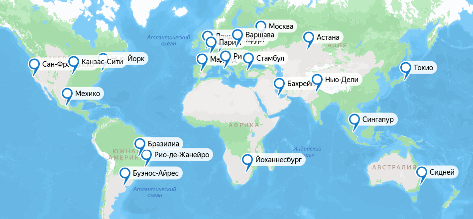
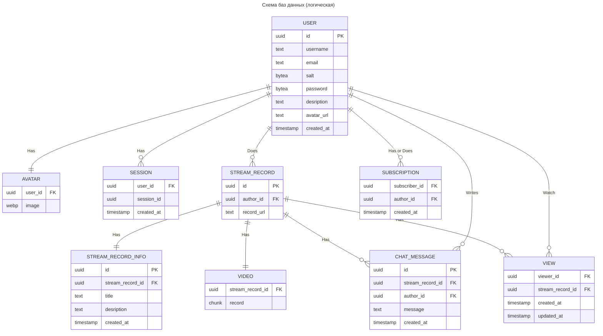

# Highload_VK_Twitch
Highload VK Education Project

## Содержание

* [**1. Тема, аудитория, функционал**](#1-тема-аудитория-функционал)

* [**2. Расчет нагрузки**](#2-расчет-нагрузки)

* [**3. Глобальная балансировка нагрузки**](#3-глобальная-балансировка-нагрузки)

* [**4. Локальная балансировка нагрузки**](#4-локальная-балансировка-нагрузки)

* [**5. Логическая схема БД**](#5-логическая-схема-бд)

* [**6. Физическая схема БД**](#6-физическая-схема-бд)

* [**7. Алгоритмы**](#7-алгоритмы)

* [**8. Технологии**](#8-технологии)

* [**Источники**](#источники)

## 1. Тема, аудитория, функционал

### Тема
Twitch - крупнейшая стриминговая платформа

### Аудитория [[1](https://www.demandsage.com/twitch-users/ "Источник")]
* Мировой рынок
* Пользователи:
  * ```140 млн. MAU```
  * ```30 млн. DAU```
  * ```2.5 млн. одновременных зрителей (в среднем)```

Распределение по регионам [[2](https://visualsbyimpulse.com/countries-most-twitch-viewers-top-15/ "Источник")]:
* *Северная Америка - ```35,63%``` пользователей*:
  * ```50 млн. MAU```
  * ```10.5 млн. DAU```
  * ```900 тыс. одновременных зрителей```
* *Европа - ```31,97%``` пользователей*:
  * ```45 млн. MAU```
  * ```9.5 млн. DAU```
  * ```800 тыс. одновременных зрителей```
* *Азия - ```17,12%``` пользователей*:
  * ```24 млн. MAU```
  * ```5 млн. DAU```
  * ```400 тыс. одновременных зрителей```
* *Южная Америка - ```12,82%``` пользователей*:
  * ```18 млн. MAU```
  * ```4 млн. DAU```
  * ```320 тыс. одновременных зрителей```
* *Океания - ```1,64%``` пользователей*:
  * ```2 млн. MAU```
  * ```500 тыс. DAU```
  * ```40 тыс. одновременных зрителей```
* *Африка - ```0,8%``` пользователей*:
  * ```1 млн. MAU```
  * ```240 тыс. DAU```
  * ```20 тыс. одновременных зрителей```

Распределение по странам [[3](https://worldpopulationreview.com/country-rankings/twitch-users-by-country "Источник")]:

| Страна             | Число пользователей (млн.) | Доля от всех пользователей (%) |
|--------------------|----------------------------|--------------------------------|
| США и Канада       | 93                         | 36.32                          |
| Бразилия           | 16.9                       | 6.6                            |
| Германия           | 16.8                       | 6.56                           |
| Великобритания     | 13.4                       | 5.23                           |
| Франция            | 11.3                       | 4.41                           |
| Россия             | 10.5                       | 4.1                            |
| Испания            | 10.5                       | 4.1                            |
| Аргентина          | 10                         | 3.9                            |
| Мексика            | 9.2                        | 3.59                           |
| Италия             | 8.3                        | 3.24                           |
| Турция             | 7.5                        | 2.92                           |
| Южная Корея        | 6.7                        | 2.61                           |
| Польша             | 4.8                        | 1.87                           |
| Япония             | 4.1                        | 1.6                            |
| Австралия          | 4.1                        | 1.6                            |
| Другие страны      | 29                         | 11.35                          |

### Функционал
* Авторизация
* Видеотрансляция
  * Проведение
  * Просмотр в лайве
  * Сохранение записи
* Чат трансляции
  * Отправка сообщений
  * Чтение сообщений
  * Сохранение записи чата

## 2. Расчет нагрузки

В силу существования на Twitch двух основных ролей - автор и зритель - с разными типичными действиями в сервисе, будем разделять продуктовые и технические метрики именно на эти две категории. К авторам отнесем метрики, связанные с хранением видеотрансляций и чатов, а к зрителям - с обменом текстовыми сообщениями и просмотром прямых трансляций.

### Авторы

Будем считать, что показатель ```DAU``` равен числу ежедневных запросов на подсоединение к трансляции. Тогда каждую секунду отправляется

$$\frac{30\cdot 10^6}{24\cdot 60\cdot 60} \approx 350$$

запросов.

Согласно статистике [[4](https://www.businessofapps.com/data/twitch-statistics/ "Источник")], за 2022 число уникальных активных (проводивших трансляцию хотя бы раз за месяц) стримеров составило ```~8 млн. человек в месяц```. В том же 2022 году стримеры суммарно проводили прямые трансляции в течение ```70 млн. часов в месяц```. Таким образом, средний стример генерирует

$$\frac{70\space 000\space 000}{8\space 000\space 000} = 8.75\space ч$$

контента в месяц.

Положим, что час среднего стрима в разрешении FullHD занимает 2 Гб памяти. Тогда пользователю-автору требуется примерно 

$$8.75\cdot 2=17\space Гб/мес$$

дискового пространства.

Суммарный параметр (общее хранилище всех стримов) составит

$$17\cdot 8\cdot 10^6=136\cdot 10^6\space Гбайт/месяц \approx 130\space Пбайт$$

Согласно официальному источнику [[5](https://help.twitch.tv/s/article/video-on-demand?language=ru "Источник")], с 2022 года срок хранения записей трансляций составляет 7 дней для новых пользователей и 60 дней для партенров Twitch и пользователей с подпиской Twitch Prime. Для удобства вычислений положим средний срок хранения записи стрима равным ```30 дней```. По этой причине все метрики, касамые хранимой информации, будем рассчитывать на месяц.

В 2022 году было зафиксировано ```48 млрд.``` сообщений [[6](https://www.adweek.com/media/easier-to-share-twitch-recap-for-2022-begins-rolling-out/#:~:text=Twitch%20began%20rolling%20out%20its,the%20Amazon%2Downed%20streaming%20platform, "Источник")], отправленных пользователями в чаты всех трансляций. Таким образом, в месяц это число составляет ```4 млрд.``` Это означает, что в день средний пользователь отправляет

$$\frac{4\cdot 10^9}{30\cdot 30\cdot 10^6} \approx 4.5$$

сообщения.

Пусть на Twitch используется 4-байтная кодировка символов (с учетом наличия смайликов и т.п.), а средний размер сообщения равен 100 символов, тогда одно текстовое сообщение в чате занимает примерно ```400 байт```. Получим, что в течение месяца вместе с записями трансляции необходимо хранить 

$$4\space 000\space 000\space 000\cdot 400=1.6\cdot 10^{12}\space байт \approx 1.46\space Тб/мес$$

сообщений.

В расчете на одного стримера получим

$$\frac{1.6\cdot 10^{12}}{8\cdot 10^6}=0.2\cdot 10^6\space байт/мес \approx 200\space Кбайт/мес$$

текстовой информации.

### Зрители

Для передачи по сети видеострима в формате FullHD (30 FPS) используют битрейт в пределах ```5-6 Мбит/c```, для потока в FullHD (60 FPS) необходим битрейт в ```6-9 Мбит/с```. Возьмем значение в ```6 Мбит/c``` для всех стримеров. При ```2.5 млн.``` одновременных зрителей, серверам Twitch необходимо раздавать

$$6\cdot 2.5\cdot 10^6=15\cdot 10^6\space Мбит/с\approx 14.3\space Тбит/с$$

видеоконтента.

Исходя из статистических данных [[7](https://marketsplash.com/ru/statistika-twitch/ "Источник")], рекордный зрительский онлайн на платформе Twitch был установлен в январе 2021 года и составил ```6.5 млн.``` одновременных зрителей. Для такой пиковой нагрузки необходим трафик в 

$$6\cdot 6.5\cdot 10^6=39\cdot 10^6\space Мбит/с \approx 37\space Тбит/с$$

Определим объем текстовой информации, передаваемой всем зрителям трансляции в чате. Уже было определено, что в месяц пользователи Twitch пишут в чатах ```4 млрд.``` сообщений. Это приблизительно ```1500 сообщений/c```. Каждое сообщение весит в среднем ```400 байт```, то есть каждую секунду генерируется текстовый контент в следующем объеме:

$$400\cdot 1500=600\space 000\space байт/с \approx 4.5\space Мбит/с$$

С учетом того, что сообщения раздаются в среднем ```2.5 млн.``` пользователям, суммарный трафик составит:

$$4.5\cdot 2.5\cdot 10^6=11.25\cdot 10^6\space Мбит/с \approx 10.7\space Тбит/с$$

Или в пиковой нагрузке (```6.5 млн.``` пользователей):

$$4.5\cdot 6.5\cdot 10^6=29.25\cdot 10^6\space Мбит/с \approx 27.8\space Тбит/с$$

Теперь оценим суточный трафик.

Видеотрансляции:

$$14.3\cdot 60\cdot 60 \cdot 24=1\space 235\space 520\space Тбит/сутки=154\space 440\space Тбайт/сутки$$

Чат:

$$10.7\cdot 60\cdot 60 \cdot 24=924\space 480\space Тбит/сутки=115\space 560\space Тбайт/сутки$$

### Продуктовые метрики

Резюмируем рассчитанные данные по продуктовым метрикам:

| Метрика                                                  | Значение |
|----------------------------------------------------------|----------|
| MAU                                                      | 140 млн. |
| DAU                                                      | 30 млн.  |
| Средний размер хранилища стримера (записи трансляций)    | 17 Гб    |
| Средний размер хранилища стримера (записи чатов)         | 200 Кбайт|
| Число запросов зрителя (на просмотр трансляции)          |  1/день  |
| Число запросов зрителя (на отправку сообщений)           | 4.5/день |

### Технические метрики

Резюмируем рассчитанные данные по техническим метрикам:

| Метрика                                                  | Значение      |
|----------------------------------------------------------|---------------|
| Размер хранилища записей трансляций                      | 130 Пбайт     |
| Размер хранилища записей чатов                           | 1.46 Тбайт    |
| Пиковое потребление в течение суток                      | 64.8 Тбит/сек |
| Суммарный суточный трафик                                | 263.7 Пбайт   |
| Число запросов зрителей (на просмотр трансляции)         | 350 RPS       |
| Число запросов зрителей (на отправку сообщений)          | 1500 RPS      |

## 3. Глобальная балансировка нагрузки

### Расположение датацентров

Согласно [распределению пользователей](#аудитория-1) по частям света, выберем расположение датацентров.

В США и Канаде (плюс Мексика) наибольшая доля пользователей Twitch, поэтому расположим датацентры на Западном, Восточном побережьях и в центре США, а также в Мексике:
* Сан-Франциско
* Нью-Йорк
* Канзас-Сити
* Мехико

Южная Америка также является довольно популярным регионом во главе с Бразилией и Аргентиной. В этих странах и расположим датацентры:
* Бразилиа
* Рио-де-Жанейро
* Буэнос-Айрес

Европа - второй по числу пользователей регион. ЦОДы будут находиться в самых крупных странах (в соответствии с [разделом](#аудитория-1)):
* Лондон
* Мадрид
* Париж
* Франкфурт
* Рим
* Варшава

Западную часть России покроют сервера во Франкфурте и Варшаве, дополнительно разместим ДЦ в столице:
* Москва

Сибирь и часть Азии будет обслуживать датацентр в Казахстане:
* Астана

Турция тоже входит в топ стран-пользователей Twitch. ДЦ в Стамбуле покроет саму Турцию, южные регионы России и Ближний Восток:
* Стамбул

Расположим ЦОД в Японии для покрытия юго-восточной Азии и Дальнего Востока РФ:
* Токио

Для западной Азии и Индии расположим ДЦ в этом регионе:
* Нью-Дели

Также позаботимся об обслуживании Аравийского полуострова и северной части Африки:
* Бахрейн

Поскольку Африка является самым непопулярным регионом, тем более ее северную часть мы уже покрыли датацентром в Бахрейне, то для оставшейся части континента хватит одного ЦОДа на юге:
* Йоханнесбург

Для Австралии и Океании также будет будет достаточно одного датацентра в крупнейшем городе:
* Сидней

Также расположим дополнительный ДЦ между Азией и Австралией:
* Сингапур

### Визуализация

По итогу имеем карту наших ДЦ следующего вида:


[Интерактивный вариант](https://yandex.ru/maps/?ll=14.254983%2C8.987680&mode=usermaps&source=constructorLink&um=constructor%3A4d5deb703484244aec400375ab5a147c2b5230ee30f04cbb8a53ca8024715496&z=2 "Карта")

## 4. Локальная балансировка нагрузки

### Балансировка прямой трансляции (поток данных от стримера)

Согласно [[8](https://blog.twitch.tv/en/2022/04/26/ingesting-live-video-streams-at-global-scale/ "Обзор инфраструктуры Twitch")], Twitch использует свой кастомный L7 балансировщик, близкий по логике к методу балансировки `Least Load`.

<ins>Кратко о балансировщике:</ins>

Twitch имеет множество прокси-серверов (в нашей терминологии `балансировщиков`), называемых *Point of Presence (PoP)* и использующих также кастомное ПО, называемое *Intelligest*, которое пришло на замену *HAProxy*. За PoP'ами стоят `сервера` (*Origin*), к которым впоследствии и будут роутиться видеопотоки. Уже сами Origin'ы раздают видеоконтент зрителям.

В задачи Intelligest входят периодические Health Check'и, а также сбор информации с Origin'ов об их текущей загрузке.

<ins>Порядок балансировки:</ins>

Стример подключается к одному из PoP (к оптимальному), который терминирует его подключение и при помощи Intelligest роутит его к одному из Origin'ов по следующим правилам:
* Базово использует информацию о загруженности Origin'ов и старается максимально использовать ресурсы каждого из них (`Least Load`)
* Дополнительно может быть произведен роутинг исходя из бизнес логики самой платформы:
  * Премиум-пользователи могут вести резервную трансляцию помимо основной, обе из которых должны попасть на один Origin и транслироваться с него
  * Балансировщик можно настроить так, чтобы стримы с конкретных каналов направлялись на конкретный Origin независимо от того, с какого PoP идет поток данных

В функционал Origin'ов входят следующие задачи:
* Перекодирование видео в различные разрешения и битрейты для того, чтобы пользователь мог выбрать подходящий формат
* Форматирование видео для дальнейшей отправки на CDN

На этом этапе мы переходим к пользовательской стороне балансировки.

### Балансировка прямой трансляции (поток данных до пользователя) [[9](https://blog.twitch.tv/en/2023/09/28/twitch-state-of-engineering-2023/ "Обзор сервисов Twitch")]

Когда зритель открывает страницу стрима, его запрос отправляется в ближайший датацентр, где прокси-сервер терминирует его подключение, а также специальным алгоритмом (основанном на так называемом *Replication Tree*) ищет Origin, с которого раздается запрашиваемая трансляция и перенаправляет ее пользователю.

### Резюме

На данном этапе имеем следующее. Балансировщик потокового контента (PoP):
* На стороне стримера
  * Терминирует подключение
  * При помощи Health Check'ов добавляет и удаляет Origin'ы из списка доступных
  * Собирает метрики с Origin'ов
  * Роутит трансляцию на конкретный Origin, основываясь на `Least Load` методе или же, дополнительно, на некоторых бизнес-требованиях
* На стороне зрителя
  * Терминирует подключение
  * Выполняет поиск Origin'а с искомой трансляцией
  * Направляет трансляцию клиенту

### Балансировка запросов по API

Для балансировки запросов по HTTPS (например, авторизация), а также по кастомным протоколам Twitch, работающим поверх TCP и WebSocket (например, различные взаимодействия с чатом), будем использовать `Nginx` как L7 балансировщик. Он будет выполнять следующие функции:
* Балансировка нагрузки между сервисами при помощи `Weighted Round-Robin` или `Least Connections` для равномерного распределения нагрузки и обеспечения отказоустойчивости
* Терминация SSL
* Реализация API-Gateway. В частности, авторизация и аутентификация; логирование и мониторинг (регистрация входящих и исходящих запросов, сбор статистики о производительности и использовании API)
* Раздача статики
* Кэширование запросов и сжатие контента

### Отказоустойчивость

Использование `Kubernetes` поможет обеспечить более высокую отказоустойчивость и более оптимальное использование ресурсов при помощи оркестрации и масштабирования сервисов, а также автоматического восстановления после сбоев и перезапуска сервисов без простоев.

Дополнительно будем использовать:
* Сбор метрик с сервисов и машин и периодические Health Check'и
* Настройка алертов для оповещения о критических ситуациях

## 5. Логическая схема БД



Рассчитаем примерный необходимый объем памяти, для хранения каждой из сущностей:

За количество пользователей сервиса возьмем 2*MAU, то есть, согласно [первому разделу](#аудитория-1), имеем

$$ 140\space млн.\cdot 2=280\space млн.\space пользователей $$

Тогда:

**USER**

$$ 16\space байт\text{ (uuid - id)} + 10\space байт\text{ (text - username)} + 40\space байт\text{ (text - email)} + 10\space байт\text{ (bytea - salt)} + 32\space байта\text{ (bytea - password)} + 500\space байт\text{ (text - description)} + 60\space байт\text{ (text - avatar-url)} + 8\space байт\text{(timestamp - created-at)}=676\space байт/пользователя $$

Общий объем данных составит

$$ 676\space байт\cdot 280\space млн. \approx 177\space Гбайт $$

**AVATAR**

Одна картинка в формате webp в разрешении 1280x800 занимает примерно ```120 Кбайт```

Тогда для всех юзеров суммарный объем хранилища составит

$$ 120\space Кбайт\cdot 280\space млн. \approx 31.3\space Тбайт $$

**STREAM_RECORD**

$$ 16\space байт\text{ (uuid - id)} + 16\space байт\text{ (uuid - author-id)} + 60\space байт\text{ (text - record-url)}=92\space байт/стрим $$

Из [раздела 2](#2-расчет-нагрузки) имеем 70 млн часов стримов в месяц. Если средний стрим длится 1 ч, то общее число стримов составляет ```70 млн.```
В таком случае:

$$ 92\space байт\cdot 70\space млн. \approx 6\space Гбайт $$

**VIDEO**

Во [втором разделе](#2-расчет-нагрузки) уже было посчитано, что необходимый месячный объем хранилища для самих стримов составляет ```130 Пбайт```.

**STREAM_RECORD_INFO**

$$ 16\space байт\text{ (uuid - id)} + 16\space байт\text{(uuid - stream-record-id)} + 50\space байт\text{ (text - title)} + 500\space байт\text{ (text - description)} + 8\space байт\text{ (timestamp - created-at)}=590\space байт/стрим $$

Итого:

$$ 590\space байт\cdot 70\space млн. \approx 39\space Гбайт $$

**CHAT_MESSAGE**

$$ 16\space байт\text{ (uuid - id)} + 16\space байт\text{ (uuid - stream-record-id)} + 16\space байт\text{ (uuid - author-id)} + 400\space байт\text{ (text - message)} + 8\space байт\text{ (timestamp - created-at)}=456\space байт/сообщение $$

При [общем объеме](#2-расчет-нагрузки) сообщений в ```4 млрд./мес``` необходимо хранилище на

$$ 456\space байт\cdot 4\space млрд. \approx 1.7\space Тбайт $$

**VIEW**

$$ 16\space байт\text{ (uuid - viewer-id)} + 16\space байт\text{ (uuid - stream-record-id)} + 8\space байт\text{ (timestamp - created-at)} + 8\space байт\text{ (timestamp - updated-at)}=48\space байт/запись $$

Пусть средний пользователь заходит на 1 стрим в день. Тогда он заходит на 30 стримов за месяц. Тогда за месяц мы получим записей на

$$ 30\cdot 48\space байт\cdot 140\space млн. \approx 188\space Гбайт $$

**SUBSCRIPTION**

$$ 16\space байт\text{ (uuid - subscriber-id)} + 16\space байт\text{ (uuid - author-id)} + 8\space байт\text{ (timestamp - created-at)}=40\space байт/запись $$

Согласно статистике, у Twitch имеется около 15 миллионов стримеров. При этом только у 1% из них онлайн выше 50 человек. Возьмем 1% от 15 миллионов и положим, что в среднем у такого стримера 1000 подписчиков. Полученное суммарное число подписчиков и возьмем за количество записей в таблице SUBSCRIPTION:

$$ \frac{15\space млн.}{100}\cdot 1000\cdot 40\space \approx 5.6\space Гбайт $$

**SESSION**

$$ 16\space байт\text{ (uuid - user-id)} + 16\space байт\text{ (uuid - session-id)} + 8\space байт\text{ (timestamp - created-at)}=40\space байт/сессию $$

Показатель DAU у Twitch составляет 30 млн. человек. Пусть каждый из них имеет по две сессии: на телефоне и компьютере. Тогда суммарный объем занимаемой памяти:

$$ 30\space млн.\cdot 2\cdot 40\space \approx 2.3\space Гбайт $$

### Резюме

|Таблица                          |Размер данных|
|---------------------------------|-------------|
|USER                             |177 Гбайт    |
|AVATAR                           |31.3 Тбайт   |
|STREAM_RECORD                    |6 Гбайт      |
|STREAM_RECORD_INFO               |39 Гбайт     |
|VIDEO                            |130 Пбайт    |
|CHAT_MESSAGE                     |1.7 Тбайт    |
|VIEW                             |188 Гбайт    |
|SUBSCRIPTION                     |5.6 Гбайт    |
|SESSION                          |2.3 Гбайт    |

### Описание сущностей

|Сущность                         |Описание|
|---------------------------------|-------------|
|USER                             |Информация о пользователе. Как техническая (*id*, *email*, *salt*, *password*), так и дополнительная (*description*, *avatar_url*, *created_at*)|
|AVATAR                           |Картинка в формате webp, ссылка на которую есть в таблице USER|
|STREAM_RECORD                    |Информация о записи трансляции. Есть ссылка на автора (*author_id*) и URL с самой записью в хранилище (*recorde_url*)|
|STREAM_RECORD_INFO               |Дополнительная информация о трансляции, заполняемая стримером и отображаемая зрителю при открытии страницы с трансляцией. Есть ссылка на запись трансляции (*stream_record_id*), название (*title*), описание (*description*), дата проведения (*created_at*)|
|VIDEO                            |Видео в специализированном формате, содержащее запись конкретной трансляции. Ссылка на видео есть в таблице STREAM_RECORD|
|CHAT_MESSAGE                     |Сообщение в чате трансляции. Хранится непосредственно само сообщение (*message*), id трансляции (*stream_record_id*), идентификатор автора (*author_id*) и время отправки сообщения (*created_at*)|
|VIEW                             |Фиксируется факт просмотра стрима (*stream_record_id*) (или его записи) зрителем (*viewer_id*), а также время первого просмотра (*created_at*) и последнего (*updated_at*)|
|SUBSCRIPTION                     |Хранит подписку пользователя (*subscriber_id*) на автора (*author_id*), а также момент оформления подписки (*created_at*)|
|SESSION                          |Содержит данные о пользовательской сессии в сервисе, а именно id пользователя (*user_id*), идентификатор сессии (*session_id*), время авторизации (*created_at*)|

### Нагрузка на чтение/запись

#### Запись

Согласно [статистике](#1-тема-аудитория-функционал), примерно треть аудитории Twitch - жители США и Канады. При этом с 2023 по 2024 год прибавилось примерно 10 млн. пользователей в этих регионах. Тогда можем оценить общий прирост пользователей по всем регионам в 30 млн. человек. В таком случае RPS на запись о регистрации в таблицу USER составит

$$\frac{30\space млн.}{365\space дней\cdot 24\space часа\cdot 60\space минут\cdot 60\space секунд} \approx 1\space \text{RPS}$$

Таким образом, нагрузка на запись о регистрации несущественна.

Известно, что в месяц число отправленных сообщений в чатах Twitch составляет примерно 4 млрд. Тогда число запросов в секунду равно

$$\frac{4\space млрд.}{30\space дней\cdot 24\space часа\cdot 60\space минут\cdot 60\space секунд} \approx 1500\space \text{RPS}$$

То есть нагрузка на запись новых сообщений значительна.

Если средний пользователь авторизуется в сервисе раз в день, то при DAU, равном 30 млн., нагрузка на запись/чтение сессий составит

$$\frac{30\space млн.}{24\space часа\cdot 60\space минут\cdot 60\space секунд} \approx 350\space \text{RPS}$$

Нагрузка является умеренной.

Из предположения о том, что в месяц проводится примерно 70 млн. стримов, можно сказать, что запись в таблицы с информацией о трансляции происходит с частотой

$$\frac{70\space млн.}{30\space дней\cdot 24\space часа\cdot 60\space минут\cdot 60\space секунд} \approx 27\space \text{RPS}$$

Если средний пользователь заходит на 1 стрим в день, а DAU составляет 30 млн., то нагрузка на запись в таблицу VIEW о просмотре стрима составит

$$\frac{30\space млн.}{24\space часа\cdot 60\space минут\cdot 60\space секунд} \approx 350\space \text{RPS}$$

Оценка числа оформляемых в секунду подписок ввиду отсутствия соответствующей статистики является непростой задачей, поэтому положим, что нагрузка на запись такой информации невелика, так как новые пользователи добавляются с частотой 1 RPS, что является весьма малым значением, поэтому оформляемые ими подписки вряд ли существенно увеличат этот показатель. А старые пользователи нечасто оформляют новые подписки и предпочитают отслеживать уже знакомых авторов.

#### Резюме по записи

Нагрузка на запись относительно невелика. Ожидается, что нагрузка на чтение будет основным типом нагрузки в сервисе. Из этого раздела имеем, что существенна только нагрузка на запись сообщений из всех чатов трансляций. Именно по этой причине у Twitch существует отдельный сервис для обработки запросов, касаемых взаимодействия пользователей в чатах.

#### Чтение

Как уже было рассчитано, сессии создаются/проверяются с частотой ```350 RPS```.

Если юзер авторизуется раз в день, то обращение к таблице USER для проверки пароля происходит ```350 раз в секунду```. Дополнительно мы обращаемся к этой таблице для подгрузки информации и стримере при подключении к трансляции. Это еще ```350 RPS```. Имеем приблизительно ```700 RPS``` на чтение данных из таблицы USER.

Будем считать, что данные о подписчиках и просмотрах стрима (сущности SUBSCRIPTION и VIEW) запрашиваются при подключении к трансляции, то есть требуется обрабатывать по ```350 RPS``` для каждой из двух таблиц.

Основная нагрузка будет приходиться на обработку запросов чанков просматриваемых стримов. При этом нагрузка на само подключение к трансляции умеренна и составляет те же ```350 RPS```. Рассчитаем нагрузку на хранилища с записями стримов. [Известно](#2-расчет-нагрузки), что одновременно на Twitch смотрят трансляции 2.5 млн. человек. Если на стриме установлена задержка в 20 секунд, то будем считать, что каждые 20 секунд 2.5 миллиона пользователей запрашивают очередной чанк на 20 секунд. Таким образом нагрузка на все хранилище или CDN от всех пользователей составит

$$\frac{2.5\space млн.}{20\space сек}=125\space 000\space \text{RPS}$$

#### Резюме по чтению

Как и ожидалось, нагрузка на чтение контента (особенно видео) весьма значительна. По этой причине нам будет необходимо создать сеть распределенных хранилищ для обслуживания такого большого количества пользователей.

## 6. Физическая схема БД

|Сущность                         |Хранилище            |Обоснование выбора|
|---------------------------------|---------------------|------------------|
|SESSION                          |Redis                |Высокопроизводительное in-memory хранилище, идеально подходит для хранения key-value структур и быстрого доступа к ним. Имеется возможность установки TTL для сессий. Таким образом, нет необходимости дополнительно проверять токен авторизации на "свежесть". Из минусов - невысокая надежность - данные могут быть утеряны в случае перезапуска сервера. Но для сессий требование надежности хранения и консистентности не является критическим|
|USER, STREAM_RECORD, STREAM_RECORD_INFO, SUBSCRIPTION, VIEW  |PostgreSQL           |PostrgreSQL является популярным решением для хранения данных в реляционной модели. Существуют готовые решения и подходы к масштабированию. СУБД предлагает полную поддержку ACID-транзакций для обеспечения должного уровня консистентности и надежности хранения данных. Присутствует возможность построения индексов для оптимизации запросов|
|CHAT_MESSAGE                     |Aerospike            |Высокопроизводительная NoSQL СУБД с оптимизацией под использование SSD для ускорения процессов чтения и записи. При обработке чата, согласно расчетам, придется часто писать данные, а также раздавать их новым подключившимся пользователям. Имеется возможность кэширования данных в памяти, а также реплицирования|
|SUBSCRIPTION, VIEW               |ClickHouse           |Аналитическая СУБД с открытым кодом, активно развивается и поддерживается. Позволяет делать аналитические Full table scan запросы. Поддержка наполнения данными из потока Apache Kafka. Будет использоваться для выдачи метрик по подписчикам и просмотрам для авторов, а также для использования в целях внутренней аналитики сервиса|
|VIDEO                            |Amazon CloudFront    |Amazon CloudFront - это распределенная система CDN, расположенная в более чем 400 точках мира на 6 континентах. Что не менее важно, этот сервис поддерживает мультибитрейтный стриминг по протоколу HLS с возможностью кэширования медиа фрагментов для ускорения отдачи контента и снижения нагрузки на сервис. Также имеется встроенный GEO-based балансировщик|
|AVATAR                           |Amazon S3            |Amazon S3 предлагает объектное хранилище данных, что обеспечивает неограниченную масштабируемость. Сервис нацелен на обеспечение доступности, надежности и низкой задержки. Имеется возможность создания репликаций. Хранилища распределены по всему миру и имеют удобное API для загрузки и извлечения данных|
|METRICS                          |VictoriaMetrics      |Представляет из себя удобное современное хранилище для технических и продуктовых метрик с открытым исходным кодом. Реализовано на языке Go, поддерживается, имеет хорошую документацию. Считается, что хранит данные эффективнее, чем аналогичный сервис Prometheus; поддерживает как pull, так и push стратегию сбора метрик; имеет собственный язык запросов MetricsQL с более широкими возможностями, чем PromQL; предоставляется в AWS|

### Индексирование

Индексирование будем применять для ускорения поиска по хранилищам. Отметим, что в ```PostgreSQL``` индекс по первичному ключу строится автоматически.

* Для таблицы USER создадим индексы для полей ```email``` и ```username``` для быстрой проверки уникальности при регистрации и ускорения поиска пользователя для аутентификации.

* В таблице STREAM_RECORD построим индекс по атрибуту ```author_id``` для более быстрого поиска и выдачи стримов конкретного автора. В таблице STREAM_RECORD_INFO добавим индекс по ```stream_record_id```.

* Для SUBSCRIPTION определим индекс по ```subscriber_id``` и ```author_id``` для ускорения выдачи списка подписок и подписчиков соответственно.

* Аналогично создадим индексы для полей ```viewer_id``` и ```stream_record_id``` в таблице VIEW для более быстрого поиска истории просмотров и, например, подсчета числа просмотров стрима.

* Сообщения из чатов мы будем хранить в JSON формате в СУБД Aerospike. Для ускорения поиска чата, относящегося к определенной трансляции, создадим индекс на поле ```stream_record_id```, для поиска сообщений от определенного пользователя проиндексируем поле ```author_id```. Для ускорения сортировки по времени отправки сообщения можно также наложить индекс на атрибут ```created_at```.

Таблица SESSION в Redis в индексах не нуждается, ибо СУБД уже представляет из себя быстрое key-value хранилище. Сервисы Amazon (S3 и CloudFront) "под капотом" уже соптимизированы и нам нет необходимости об этом заботиться.

### Шардирование

Почти все таблицы (USER, STREAM_RECORD, STREAM_RECORD_INFO, SUBSCRIPTION, VIEW, CHAT_MESSAGE), зависящие от популярности автора можно вынести в отдельные шарды, опираясь на число подписчиков, просмотров того или иного автора, так как эти таблицы для них будут обновляться и читаться наиболее часто. Остальных пользователей можно распределять по шардам, используя хэш от ```id```.

### Реплицирование

Будем использовать стандартную схему физической репликации с одним ```Мастером``` и множеством ```Реплик```. Мастер будет работать на запись и множество Реплик будут отдавать данные, так как было установлено, что запросов на чтение в сервисе больше, чем на запись. Для ускорения работы системы Реплики можно сделать асинхронными, поскольку некоторое отставание от Мастера не является критичным.

### Схема резервного копирования

В качестве схемы резервного копирования предлагается использовать ```инкрементальное резервное копирование```, которое достаточно быстро, хотя для восстановления данных времени потребуется несколько больше, чем при других подходах.

### Мультиплексирование подключений

Для мультиплексирования подключений к ```PostgreSQL``` можем использовать PgBouncer в целях снижения количества подключений к самой базе и ускорения ее работы.

## 7. Алгоритмы

### [Transmuxing/Transcoding](https://blog.twitch.tv/en/2017/10/10/live-video-transmuxing-transcoding-f-fmpeg-vs-twitch-transcoder-part-i-489c1c125f28/)

На пике нагрузки Twitch обрабатывает и раздает пользователям по всему миру десятки тысяч видеопотоков одновременно. Следующая схема отражает логику передачи контента от стримера до зрителя:


Этапы установления соединения с автором и первоначальной обработки видеосигнала (*Ingest*), а также распределения видеопотоков по различным CDN серверам (*Replication*) и раздача контента до конечного потребителя (*Edge*) уже были описаны в [предыдущих разделах работы](#4-локальная-балансировка-нагрузки). Данная же часть посвящена тем оптимизациям, которые были сделаны для максимально рационального использования вычислительных мощностей серверов при перекодировании и масштабировании видеоконтента (*Transcode*).

Twitch принимает трансляцию от автора по потоковому протоколу ```RTMP```, а для раздачи контента зрителям применяется протокол ```HLS```. Таким образом, входящий сигнал должен быть преобразован (*Transmuxed*) в формат, с которым работает протокол HLS. Более того, для обеспечения бесперебойного просмотра стрима у "медленных" клиентов (с низкой скоростью интернета), исходный поток нужно перекодировать (*Transcode*) в ряд других, имеющих иное разрешение или частоту кадров. За решение этой задачи существует модуль, называемый ```Transcoder```. При этом отметим, что оригинальный видеопоток (называемый *Source*), проходя через этот модуль только преобразуется к соответствующему HLS-формату без изменения самого контента (это делается в целях экономии вычислительных мощностей, поскольку кодирование видео является довольно затратным в этом смысле процессом, в особенности для видео в высоком разрешении и с высокой частотой кадров, коим, скорее всего, и является Source). Описанный принцип иллюстрирует следующая схема:


Пусть мы получаем от стримера видео по протоколу RTMP в формате 1080p60 (то есть разрешение 1920x1080 с частотой кадров 60). Нам необходимо получить 4 HLS-варианта видео:
* 1080p60 HLS/H.264
* 720p60 HLS/H.264
* 720p30 HLS/H.264
* 480p30 HLS/H.264

Как видно из схемы выше, транскодер принимает $1$ входной поток и выдает $N$ выходных (схема *1-in-N-out*). Этого можно достигнуть, запустив $N$ независимых экземпляров ```FFmpeg``` (ПО для обработки и декодирования видео), каждый из которых принимает $1$ поток, обрабатывает его и выдает $1$ (схема *1-in-1-out*). Отметим, что в нашем случае $N = 4$. При этом "внутреннее" устройство каждого FFmpeg-транскодера выглядит следующим образом:


Таким образом, в общем случае мы имеем $N$ запущенных декодеров оригинальной дорожки (*Video Decoder*), $N$ преобразователей масштаба (*Video Scaler*) и $N$ кодировщиков в подходящий для HLS формат (*Video Encoder*). Поскольку входящий и выходящий поток одинаков для всех $N$ декодеров, в целях экономии ресурсов можно оставить лишь один, который будет отдавать декодированные фреймы последующим модулям:


Важно заметить, что преобразователь масштаба (*Scaler*) выполняет самую ресурсоёмкую работу в данной цепочке и его работу желательно оптимизировать. Twitch делает это следующим образом:

Если еще раз взглянуть на требуемые в нашей задаче выходные форматы видео, можно заметить, что варианты 720p60 и 720p30 отличаются лишь частотой кадров и, вообще говоря, могут использовать один Scaler на двоих. Такой механизм реализуется за счет использования многопоточной модели обработки видео и может быть проиллюстрирован следующей схемой:


Как уже было отмечено, в данном случае два видеоряда отличаются лишь частотой кадров. Видео, обрабатываемое потоком *Thread 1* имеет в два раза больше кадров, чем видео из потока *Thread 2*. Таким образом, кадры из потока *Thread 2* есть подмножество кадров из *Thread 1*. 

Согласно алгоритму, у двух потоков имеется общий буфер (*Shared Buffer*), потоки "складывают" в него фреймы и буфер постепенно отправляет их в Scaler для масштабирования. Когда в очередной раз поток приходит в буфер и кладет кадр, то в том случае, если этот кадр уже был обработан, он возвращается соответствующему потоку и Scaler не вызывается. В противном случае, кадр вновь помещается в буфер и будет обработан позднее.

Как отмечает Twitch, такая модель действительно позволяет быстрее и эффективнее обрабатывать видеопотоки и является незаменимой при масштабировании и кодировании видео в разрешении 4K.

Описанные оптимизации легли в основу кастомного ```TwitchTranscoder```, созданного на базе упомянутого FFmpeg. FFmpeg не способен использовать многопоточность для обработки в том случае, если входящий видеоряд (Source) всего один (число используемых потоков определяется именно их количеством), даже если число выходных составляет $N > 1$. Разработанный компанией алгоритм, как легко можно убедиться, вполне успешно справляется с этой задачей. Для иллюстрации данного преимущества можно привести следующие бенчмарки:

* Нетрудно увидеть, что при обработке одного видеопотока в 720p60 время работы этих двух инструментов практически идентично, поскольку в таком случае они оба используют один поток для транскодирования, а в основе лежат одинаковые принципы:


* Однако при необходимости получить два и более выходных потока из одного входящего, время работы FFmpeg начинает линейно расти, в то время как TwitchTranscoder использует multithreaded-модель и выполняет свою задачу значительно эффективнее:


## 8. Технологии


## Источники

1. https://www.demandsage.com/twitch-users/
2. https://visualsbyimpulse.com/countries-most-twitch-viewers-top-15/
3. https://worldpopulationreview.com/country-rankings/twitch-users-by-country
4. https://www.businessofapps.com/data/twitch-statistics/
5. https://help.twitch.tv/s/article/video-on-demand?language=ru
6. https://www.adweek.com/media/easier-to-share-twitch-recap-for-2022-begins-rolling-out/#:~:text=Twitch%20began%20rolling%20out%20its,the%20Amazon%2Downed%20streaming%20platform
7. https://marketsplash.com/ru/statistika-twitch/
8. https://blog.twitch.tv/en/2022/04/26/ingesting-live-video-streams-at-global-scale/
9. https://blog.twitch.tv/en/2023/09/28/twitch-state-of-engineering-2023/
10. https://blog.twitch.tv/en/2017/10/10/live-video-transmuxing-transcoding-f-fmpeg-vs-twitch-transcoder-part-i-489c1c125f28/