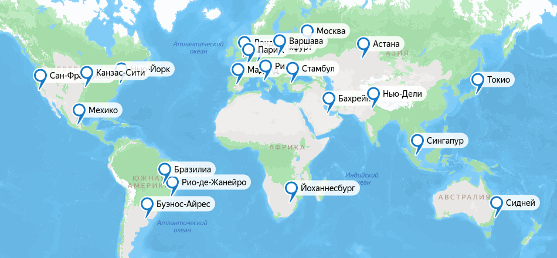
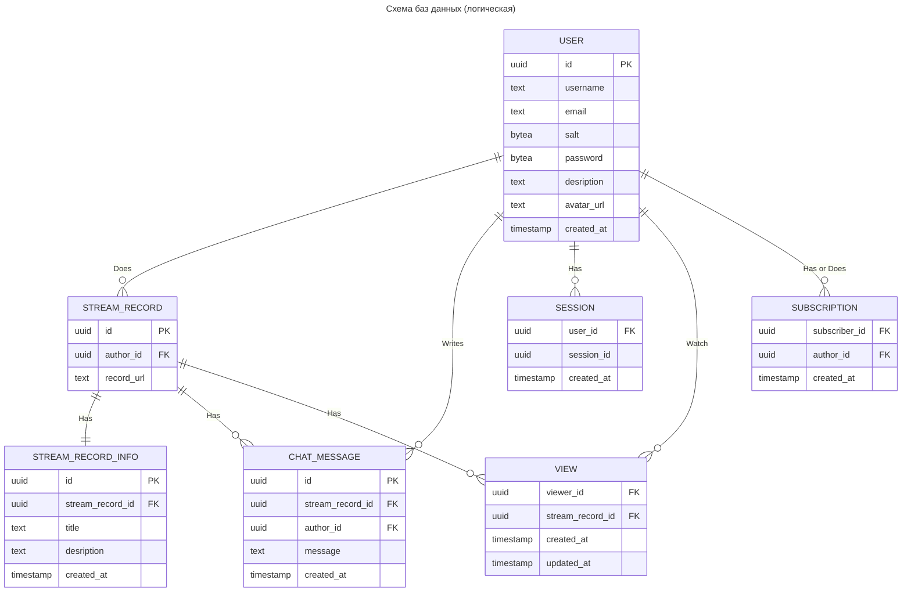

# Highload_VK_Twitch
Highload VK Education Project

## 1. Тема, аудитория, функционал

### Тема
Twitch - крупнейшая стриминговая платформа

### Аудитория [[1](https://www.demandsage.com/twitch-users/ "Источник")]
* Мировой рынок
* Пользователи:
  * ```140 млн. MAU```
  * ```30 млн. DAU```
  * ```2.5 млн. одновременных зрителей (в среднем)```

Распределение по регионам [[2](https://visualsbyimpulse.com/countries-most-twitch-viewers-top-15/ "Источник")]:
* *Северная Америка - ```35,63%``` пользователей*:
  * ```50 млн. MAU```
  * ```10.5 млн. DAU```
  * ```900 тыс. одновременных зрителей```
* *Европа - ```31,97%``` пользователей*:
  * ```45 млн. MAU```
  * ```9.5 млн. DAU```
  * ```800 тыс. одновременных зрителей```
* *Азия - ```17,12%``` пользователей*:
  * ```24 млн. MAU```
  * ```5 млн. DAU```
  * ```400 тыс. одновременных зрителей```
* *Южная Америка - ```12,82%``` пользователей*:
  * ```18 млн. MAU```
  * ```4 млн. DAU```
  * ```320 тыс. одновременных зрителей```
* *Океания - ```1,64%``` пользователей*:
  * ```2 млн. MAU```
  * ```500 тыс. DAU```
  * ```40 тыс. одновременных зрителей```
* *Африка - ```0,8%``` пользователей*:
  * ```1 млн. MAU```
  * ```240 тыс. DAU```
  * ```20 тыс. одновременных зрителей```

Распределение по странам [[3](https://worldpopulationreview.com/country-rankings/twitch-users-by-country "Источник")]:

| Страна             | Число пользователей (млн.) | Доля от всех пользователей (%) |
|--------------------|----------------------------|--------------------------------|
| США и Канада       | 93                         | 36.32                          |
| Бразилия           | 16.9                       | 6.6                            |
| Германия           | 16.8                       | 6.56                           |
| Великобритания     | 13.4                       | 5.23                           |
| Франция            | 11.3                       | 4.41                           |
| Россия             | 10.5                       | 4.1                            |
| Испания            | 10.5                       | 4.1                            |
| Аргентина          | 10                         | 3.9                            |
| Мексика            | 9.2                        | 3.59                           |
| Италия             | 8.3                        | 3.24                           |
| Турция             | 7.5                        | 2.92                           |
| Южная Корея        | 6.7                        | 2.61                           |
| Польша             | 4.8                        | 1.87                           |
| Япония             | 4.1                        | 1.6                            |
| Австралия          | 4.1                        | 1.6                            |
| Другие страны      | 29                         | 11.35                          |

### Функционал
* Авторизация
* Видеотрансляция
  * Проведение
  * Просмотр в лайве
  * Сохранение записи
* Чат трансляции
  * Отправка сообщений
  * Чтение сообщений
  * Сохранение записи чата

## 2. Расчет нагрузки

В силу существования на Twitch двух основных ролей - автор и зритель - с разными типичными действиями в сервисе, будем разделять продуктовые и технические метрики именно на эти две категории. К авторам отнесем метрики, связанные с хранением видеотрансляций и чатов, а к зрителям - с обменом текстовыми сообщениями и просмотром прямых трансляций.

### Авторы

Будем считать, что показатель ```DAU``` равен числу ежедневных запросов на подсоединение к трансляции. Тогда каждую секунду отправляется

$$\frac{30\cdot 10^6}{24\cdot 60\cdot 60} \approx 350$$

запросов.

Согласно статистике [[4](https://www.businessofapps.com/data/twitch-statistics/ "Источник")], за 2022 число уникальных активных (проводивших трансляцию хотя бы раз за месяц) стримеров составило ```~8 млн. человек в месяц```. В том же 2022 году стримеры суммарно проводили прямые трансляции в течение ```70 млн. часов в месяц```. Таким образом, средний стример генерирует

$$\frac{70\space 000\space 000}{8\space 000\space 000} = 8.75\space ч$$

контента в месяц.

Положим, что час среднего стрима в разрешении FullHD занимает 2 Гб памяти. Тогда пользователю-автору требуется примерно 

$$8.75\cdot 2=17\space Гб/мес$$

дискового пространства.

Суммарный параметр (общее хранилище всех стримов) составит

$$17\cdot 8\cdot 10^6=136\cdot 10^6\space Гбайт/месяц \approx 130\space Пбайт$$

Согласно официальному источнику [[5](https://help.twitch.tv/s/article/video-on-demand?language=ru "Источник")], с 2022 года срок хранения записей трансляций составляет 7 дней для новых пользователей и 60 дней для партенров Twitch и пользователей с подпиской Twitch Prime. Для удобства вычислений положим средний срок хранения записи стрима равным ```30 дней```. По этой причине все метрики, касамые хранимой информации, будем рассчитывать на месяц.

В 2022 году было зафиксировано ```48 млрд.``` сообщений [[6](https://www.adweek.com/media/easier-to-share-twitch-recap-for-2022-begins-rolling-out/#:~:text=Twitch%20began%20rolling%20out%20its,the%20Amazon%2Downed%20streaming%20platform, "Источник")], отправленных пользователями в чаты всех трансляций. Таким образом, в месяц это число составляет ```4 млрд.``` Это означает, что в день средний пользователь отправляет

$$\frac{4\cdot 10^9}{30\cdot 30\cdot 10^6} \approx 4.5$$

сообщения.

Пусть на Twitch используется 4-байтная кодировка символов (с учетом наличия смайликов и т.п.), а средний размер сообщения равен 100 символов, тогда одно текстовое сообщение в чате занимает примерно ```400 байт```. Получим, что в течение месяца вместе с записями трансляции необходимо хранить 

$$4\space 000\space 000\space 000\cdot 400=1.6\cdot 10^{12}\space байт \approx 1.46\space Тб/мес$$

сообщений.

В расчете на одного стримера получим

$$\frac{1.6\cdot 10^{12}}{8\cdot 10^6}=0.2\cdot 10^6\space байт/мес \approx 200\space Кбайт/мес$$

текстовой информации.

### Зрители

Для передачи по сети видеострима в формате FullHD (30 FPS) используют битрейт в пределах ```5-6 Мбит/c```, для потока в FullHD (60 FPS) необходим битрейт в ```6-9 Мбит/с```. Возьмем значение в ```6 Мбит/c``` для всех стримеров. При ```2.5 млн.``` одновременных зрителей, серверам Twitch необходимо раздавать

$$6\cdot 2.5\cdot 10^6=15\cdot 10^6\space Мбит/с\approx 14.3\space Тбит/с$$

видеоконтента.

Исходя из статистических данных [[7](https://marketsplash.com/ru/statistika-twitch/ "Источник")], рекордный зрительский онлайн на платформе Twitch был установлен в январе 2021 года и составил ```6.5 млн.``` одновременных зрителей. Для такой пиковой нагрузки необходим трафик в 

$$6\cdot 6.5\cdot 10^6=39\cdot 10^6\space Мбит/с \approx 37\space Тбит/с$$

Определим объем текстовой информации, передаваемой всем зрителям трансляции в чате. Уже было определено, что в месяц пользователи Twitch пишут в чатах ```4 млрд.``` сообщений. Это приблизительно ```1500 сообщений/c```. Каждое сообщение весит в среднем ```400 байт```, то есть каждую секунду генерируется текстовый контент в следующем объеме:

$$400\cdot 1500=600\space 000\space байт/с \approx 4.5\space Мбит/с$$

С учетом того, что сообщения раздаются в среднем ```2.5 млн.``` пользователям, суммарный трафик составит:

$$4.5\cdot 2.5\cdot 10^6=11.25\cdot 10^6\space Мбит/с \approx 10.7\space Тбит/с$$

Или в пиковой нагрузке (```6.5 млн.``` пользователей):

$$4.5\cdot 6.5\cdot 10^6=29.25\cdot 10^6\space Мбит/с \approx 27.8\space Тбит/с$$

Теперь оценим суточный трафик.

Видеотрансляции:

$$14.3\cdot 60\cdot 60 \cdot 24=1\space 235\space 520\space Тбит/сутки=154\space 440\space Тбайт/сутки$$

Чат:

$$10.7\cdot 60\cdot 60 \cdot 24=924\space 480\space Тбит/сутки=115\space 560\space Тбайт/сутки$$

### Продуктовые метрики

Резюмируем рассчитанные данные по продуктовым метрикам:

| Метрика                                                  | Значение |
|----------------------------------------------------------|----------|
| MAU                                                      | 140 млн. |
| DAU                                                      | 30 млн.  |
| Средний размер хранилища стримера (записи трансляций)    | 17 Гб    |
| Средний размер хранилища стримера (записи чатов)         | 200 Кбайт|
| Число запросов зрителя (на просмотр трансляции)          |  1/день  |
| Число запросов зрителя (на отправку сообщений)           | 4.5/день |

### Технические метрики

Резюмируем рассчитанные данные по техническим метрикам:

| Метрика                                                  | Значение      |
|----------------------------------------------------------|---------------|
| Размер хранилища записей трансляций                      | 130 Пбайт     |
| Размер хранилища записей чатов                           | 1.46 Тбайт    |
| Пиковое потребление в течение суток                      | 64.8 Тбит/сек |
| Суммарный суточный трафик                                | 263.7 Пбайт   |
| Число запросов зрителей (на просмотр трансляции)         | 350 RPS       |
| Число запросов зрителей (на отправку сообщений)          | 1500 RPS      |

## 3. Глобальная балансировка нагрузки

### Расположение датацентров

Согласно [распределению пользователей](#аудитория-1) по частям света, выберем расположение датацентров.

В США и Канаде (плюс Мексика) наибольшая доля пользователей Twitch, поэтому расположим датацентры на Западном, Восточном побережьях и в центре США, а также в Мексике:
* Сан-Франциско
* Нью-Йорк
* Канзас-Сити
* Мехико

Южная Америка также является довольно популярным регионом во главе с Бразилией и Аргентиной. В этих странах и расположим датацентры:
* Бразилиа
* Рио-де-Жанейро
* Буэнос-Айрес

Европа - второй по числу пользователей регион. ЦОДы будут находиться в самых крупных странах (в соответствии с [разделом](#аудитория-1)):
* Лондон
* Мадрид
* Париж
* Франкфурт
* Рим
* Варшава

Западную часть России покроют сервера во Франкфурте и Варшаве, дополнительно разместим ДЦ в столице:
* Москва

Сибирь и часть Азии будет обслуживать датацентр в Казахстане:
* Астана

Турция тоже входит в топ стран-пользователей Twitch. ДЦ в Стамбуле покроет саму Турцию, южные регионы России и Ближний Восток:
* Стамбул

Расположим ЦОД в Японии для покрытия юго-восточной Азии и Дальнего Востока РФ:
* Токио

Для западной Азии и Индии расположим ДЦ в этом регионе:
* Нью-Дели

Также позаботимся об обслуживании Аравийского полуострова и северной части Африки:
* Бахрейн

Поскольку Африка является самым непопулярным регионом, тем более ее северную часть мы уже покрыли датацентром в Бахрейне, то для оставшейся части континента хватит одного ЦОДа на юге:
* Йоханнесбург

Для Австралии и Океании также будет будет достаточно одного датацентра в крупнейшем городе:
* Сидней

Также расположим дополнительный ДЦ между Азией и Австралией:
* Сингапур

### Визуализация

По итогу имеем карту наших ДЦ следующего вида:


[Интерактивный вариант](https://yandex.ru/maps/?ll=14.254983%2C8.987680&mode=usermaps&source=constructorLink&um=constructor%3A4d5deb703484244aec400375ab5a147c2b5230ee30f04cbb8a53ca8024715496&z=2 "Карта")

## 4. Локальная балансировка нагрузки

### Балансировка прямой трансляции (поток данных от стримера)

Согласно [[8](https://blog.twitch.tv/en/2022/04/26/ingesting-live-video-streams-at-global-scale/ "Обзор инфраструктуры Twitch")], Twitch использует свой кастомный L7 балансировщик, близкий по логике к методу балансировки `Least Load`.

<ins>Кратко о балансировщике:</ins>

Twitch имеет множество прокси-серверов (в нашей терминологии `балансировщиков`), называемых *Point of Presence (PoP)* и использующих также кастомное ПО, называемое *Intelligest*, которое пришло на замену *HAProxy*. За PoP'ами стоят `сервера` (*Origin*), к которым впоследствии и будут роутиться видеопотоки. Уже сами Origin'ы раздают видеоконтент зрителям.

В задачи Intelligest входят периодические Health Check'и, а также сбор информации с Origin'ов об их текущей загрузке.

<ins>Порядок балансировки:</ins>

Стример подключается к одному из PoP (к оптимальному), который терминирует его подключение и при помощи Intelligest роутит его к одному из Origin'ов по следующим правилам:
* Базово использует информацию о загруженности Origin'ов и старается максимально использовать ресурсы каждого из них (`Least Load`)
* Дополнительно может быть произведен роутинг исходя из бизнес логики самой платформы:
  * Премиум-пользователи могут вести резервную трансляцию помимо основной, обе из которых должны попасть на один Origin и транслироваться с него
  * Балансировщик можно настроить так, чтобы стримы с конкретных каналов направлялись на конкретный Origin независимо от того, с какого PoP идет поток данных

В функционал Origin'ов входят следующие задачи:
* Перекодирование видео в различные разрешения и битрейты для того, чтобы пользователь мог выбрать подходящий формат
* Форматирование видео для дальнейшей отправки на CDN

На этом этапе мы переходим к пользовательской стороне балансировки.

### Балансировка прямой трансляции (поток данных до пользователя) [[9](https://blog.twitch.tv/en/2023/09/28/twitch-state-of-engineering-2023/ "Обзор сервисов Twitch")]

Когда зритель открывает страницу стрима, его запрос отправляется в ближайший датацентр, где прокси-сервер терминирует его подключение, а также специальным алгоритмом (основанном на так называемом *Replication Tree*) ищет Origin, с которого раздается запрашиваемая трансляция и перенаправляет ее пользователю.

### Резюме

На данном этапе имеем следующее. Балансировщик потокового контента (PoP):
* На стороне стримера
  * Терминирует подключение
  * При помощи Health Check'ов добавляет и удаляет Origin'ы из списка доступных
  * Собирает метрики с Origin'ов
  * Роутит трансляцию на конкретный Origin, основываясь на `Least Load` методе или же, дополнительно, на некоторых бизнес-требованиях
* На стороне зрителя
  * Терминирует подключение
  * Выполняет поиск Origin'а с искомой трансляцией
  * Направляет трансляцию клиенту

### Балансировка запросов по API

Для балансировки запросов по HTTPS (например, авторизация), а также по кастомным протоколам Twitch, работающим поверх TCP и WebSocket (например, различные взаимодействия с чатом), будем использовать `Nginx` как L7 балансировщик. Он будет выполнять следующие функции:
* Балансировка нагрузки между сервисами при помощи `Weighted Round-Robin` или `Least Connections` для равномерного распределения нагрузки и обеспечения отказоустойчивости
* Терминация SSL
* Реализация API-Gateway. В частности, авторизация и аутентификация; логирование и мониторинг (регистрация входящих и исходящих запросов, сбор статистики о производительности и использовании API)
* Раздача статики
* Кэширование запросов и сжатие контента

### Отказоустойчивость

Использование `Kubernetes` поможет обеспечить более высокую отказоустойчивость и более оптимальное использование ресурсов при помощи оркестрации и масштабирования сервисов, а также автоматического восстановления после сбоев и перезапуска сервисов без простоев.

Дополнительно будем использовать:
* Сбор метрик с сервисов и машин и периодические Health Check'и
* Настройка алертов для оповещения о критических ситуациях

## 5. Логическая схема БД



Рассчитаем примерный необходимый объем памяти, для хранения каждой из сущностей:

За количество пользователей сервиса возьмем 2*MAU, то есть, согласно [первому разделу](#аудитория-1), имеем

$$ 140\space млн.\cdot 2=280\space млн.\space пользователей $$

Тогда:

**USER**

$$ 16\space байт\text{ (uuid - id)} + 10\space байт\text{ (text - username)} + 40\space байт\text{ (text - email)} + 10\space байт\text{ (bytea - salt)} + 32\space байта\text{ (bytea - password)} + 500\space байт\text{ (text - description)} + 60\space байт\text{ (text - avatar url)} + 8\space байт\text{(timestamp - created\_at)}=676\space байт/пользователя $$

Общий объем данных составит

$$ 676\space байт\cdot 280\space млн. \approx 177\space Гбайт $$

**STREAM_RECORD**

$$ 16\space байт\text{ (uuid - id)} + 16\space байт\text{ (uuid - author\_id)} + 60\space байт\text{ (text - record\_url)}=92\space байт/стрим $$

Из [раздела 2](#2-расчет-нагрузки) имеем 70 млн часов стримов в месяц. Если средний стрим длится 1 ч, то общее число стримов составляет $ 70\space млн. $
В таком случае:

$$ 92\space байт\cdot 70\space млн. \approx 6\space Гбайт $$

Во [втором разделе](#2-расчет-нагрузки) уже было посчитано, что необходимый месячный объем хранилища для самих стримов составляет $ 130\space Пбайт $.

**STREAM_RECORD_INFO**

$$ 16\space байт\text{ (uuid - id)} + 16\space байт\text{(uuid - stream\_record\_id)} + 50\space байт\text{ (text - title)} + 500\space байт\text{ (text - description)} + 8\space байт\text{ (timestamp - created\_at)}=590\space байт/стрим $$

Итого:

$$ 590\space байт\cdot 70\space млн. \approx 39\space Гбайт $$

**CHAT_MESSAGE**

$$ 16\space байт\text{ (uuid - id)} + 16\space байт\text{ (uuid - stream\_record\_id)} + 16\space байт\text{ (uuid - author\_id)} + 400\space байт\text{ (text - message)} + 8\space байт\text{ (timestamp - created\_at)}=456\space байт/сообщение $$

При [общем объеме](#2-расчет-нагрузки) сообщений в $ 4\space млрд./мес $ необходимо хранилище на

$$ 456\space байт\cdot 4\space млрд. \approx 1.7\space Тбайт $$

**VIEW**

$$ 16\space байт\text{ (uuid - viewer\_id)} + 16\space байт\text{ (uuid - stream\_record\_id)} + 8\space байт\text{ (timestamp - created\_at)} + 8\space байт\text{ (timestamp - updated\_at)}=48\space байт/запись $$

Пусть средний пользователь заходит на 1 стрим в день. Тогда он заходит на 30 стримов за месяц. Тогда за месяц мы получим записей на

$$ 30\cdot 48\space байт\cdot 140\space млн. \approx 188\space Гбайт $$

**SUBSCRIPTION**

$$ 16\space байт\text{ (uuid - subscriber\_id)} + 16\space байт\text{ (uuid - author\_id)} + 8\space байт\text{ (timestamp - created\_at)}=40\space байт/запись $$

Согласно статистике, у Twitch имеется около 15 миллионов стримеров. При этом только у 1% из них онлайн выше 50 человек. Возьмем 1% от 15 миллионов и положим, что в среднем у такого стримера 1000 подписчиков. Полученное суммарное число подписчиков и возьмем за количество записей в таблице SUBSCRIPTION:

$$ \frac{15\space млн.}{100}\cdot 1000\cdot 40\space \approx 5.6\space Гбайт $$

**SESSION**

$$ 16\space байт\text{ (uuid - user\_id)} + 16\space байт\text{ (uuid - session\_id)} + 8\space байт\text{ (timestamp - created\_at)}=40\space байт/сессию $$

Показатель DAU у Twitch составляет 30 млн. человек. Пусть каждый из них имеет по две сессии: на телефоне и компьютере. Тогда суммарный объем занимаемой памяти:

$$ 30\space млн.\cdot 2\cdot 40\space \approx 2.3\space Гбайт $$

## Источники
1. https://www.demandsage.com/twitch-users/
2. https://visualsbyimpulse.com/countries-most-twitch-viewers-top-15/
3. https://worldpopulationreview.com/country-rankings/twitch-users-by-country
4. https://www.businessofapps.com/data/twitch-statistics/
5. https://help.twitch.tv/s/article/video-on-demand?language=ru
6. https://www.adweek.com/media/easier-to-share-twitch-recap-for-2022-begins-rolling-out/#:~:text=Twitch%20began%20rolling%20out%20its,the%20Amazon%2Downed%20streaming%20platform
7. https://marketsplash.com/ru/statistika-twitch/
8. https://blog.twitch.tv/en/2022/04/26/ingesting-live-video-streams-at-global-scale/
9. https://blog.twitch.tv/en/2023/09/28/twitch-state-of-engineering-2023/