# HighLoad Twitch

*HighLoad VK Education Project*

Coursework on the module "Designing High-Load Systems"  
*Vladimir Borozenets, Spring 2024*

## Contents

* [**1. Topic, Audience, Functionality**](#1-topic-audience-functionality)

* [**2. Load Calculation**](#2-load-calculation)

* [**3. Global Load Balancing**](#3-global-load-balancing)

* [**4. Local Load Balancing**](#4-local-load-balancing)

* [**5. Logical DB Schema**](#5-logical-db-schema)

* [**6. Physical DB Schema**](#6-physical-db-schema)

* [**7. Distributed Algorithms**](#7-distributed-algorithms)

* [**8. Technologies**](#8-technologies)

* [**9. Project Flowchart**](#9-project-flowchart)

* [**10. Ensuring Reliability**](#10-ensuring-reliability)

* [**11. Resource Calculation**](#11-resource-calculation)

* [**Sources**](#sources)

## 1. Topic, Audience, Functionality

### Topic
Twitch - the largest video streaming platform

### Audience [[1](https://www.demandsage.com/twitch-users/ "Source")]
* Global market
* Users:
  * ```140 million MAU```
  * ```30 million DAU```
  * ```2.5 million concurrent viewers (on average)```

Distribution by region [[2](https://visualsbyimpulse.com/countries-most-twitch-viewers-top-15/ "Source")]:
* *North America - ```35,63%``` of users*:
  * ```50 million MAU```
  * ```10.5 million DAU```
  * ```900k concurrent viewers```
* *Europe - ```31,97%``` of users*:
  * ```45 million MAU```
  * ```9.5 million DAU```
  * ```800k concurrent viewers```
* *Asia - ```17,12%``` of users*:
  * ```24 million MAU```
  * ```5 million DAU```
  * ```400k concurrent viewers```
* *South America - ```12,82%``` of users*:
  * ```18 million MAU```
  * ```4 million DAU```
  * ```320k concurrent viewers```
* *Oceania - ```1,64%``` of users*:
  * ```2 million MAU```
  * ```500k DAU```
  * ```40k concurrent viewers```
* *Africa - ```0,8%``` of users*:
  * ```1 million MAU```
  * ```240k DAU```
  * ```20k concurrent viewers```

Distribution by country [[3](https://worldpopulationreview.com/country-rankings/twitch-users-by-country "Source")]:

| Country            | Number of users (millions) | Percentage of all users (%) |
|--------------------|----------------------------|--------------------------------|
| USA & Canada       | 93                         | 36.32                          |
| Brazil             | 16.9                       | 6.6                            |
| Germany            | 16.8                       | 6.56                           |
| United Kingdom     | 13.4                       | 5.23                           |
| France             | 11.3                       | 4.41                           |
| Russia             | 10.5                       | 4.1                            |
| Spain              | 10.5                       | 4.1                            |
| Argentina          | 10                         | 3.9                            |
| Mexico             | 9.2                        | 3.59                           |
| Italy              | 8.3                        | 3.24                           |
| Turkey             | 7.5                        | 2.92                           |
| South Korea        | 6.7                        | 2.61                           |
| Poland             | 4.8                        | 1.87                           |
| Japan              | 4.1                        | 1.6                            |
| Australia          | 4.1                        | 1.6                            |
| Other countries    | 29                         | 11.35                           |

### Functionality
* Authorization
* Video streaming
  * Broadcasting
  * Live viewing
  * Saving recordings
* Stream chat
  * Sending messages
  * Reading messages
  * Saving chat logs

## 2. Load Calculation

Due to the existence of two main roles on Twitch - creator and viewer - with different typical actions in the service, we will divide the product and technical metrics into these two categories. For creators, we will consider metrics related to the storage of video streams and chats, and for viewers - text message exchange and live stream viewing.

### Creators

We will assume that the ```DAU``` metric is equal to the number of daily requests to connect to a stream. Then, every second,

$$\frac{30\cdot 10^6}{24\cdot 60\cdot 60} \approx 350$$

requests are sent.

According to statistics [[4](https://www.businessofapps.com/data/twitch-statistics/ "Source")], in 2022 the number of unique active streamers (who streamed at least once a month) was ```~8 million people per month```. In the same year, streamers collectively broadcasted for ```70 million hours per month```. Thus, the average streamer generates

$$\frac{70\space 000\space 000}{8\space 000\space 000} = 8.75\space hours$$

of content per month.

Let us assume that one hour of an average stream in FullHD resolution takes up 2 GB of disk space. Then a creator needs approximately 

$$8.75\cdot 2=17\space GB/month$$

of disk space.

The total parameter (total storage of all recordings) will be

$$17\cdot 8\cdot 10^6=136\cdot 10^6\space GB/month \approx 130\space PBytes$$

According to the official source [[5](https://help.twitch.tv/s/article/video-on-demand?language=ru "Source")], since 2022, the storage period for stream recordings is 7 days for new users and 60 days for Twitch partners and users with a Twitch Prime subscription. For ease of calculation, we will assume the average stream recording storage period is 30 days. For this reason, all metrics concerning stored information will be calculated on a monthly basis.

In 2022, ```48 billion``` messages were recorded [[6](https://www.adweek.com/media/easier-to-share-twitch-recap-for-2022-begins-rolling-out/#:~:text=Twitch%20began%20rolling%20out%20its,the%20Amazon%2Downed%20streaming%20platform, "Source")], sent by users in the chats of all streams. Thus, the monthly number is ```4 billion```. This means that an average user sends

$$\frac{4\cdot 10^9}{30\cdot 30\cdot 10^6} \approx 4.5$$

messages per day.

Let us assume Twitch uses a 4-byte character encoding (to account for emojis, etc.), and the average message size is 100 characters. Then one text message in the chat takes up approximately ```400 bytes```. We find that during a month, along with stream recordings, it is necessary to store

$$4\space 000\space 000\space 000\cdot 400=1.6\cdot 10^{12}\space bytes \approx 1.46\space TB/month$$

of messages.

Per streamer, we get

$$\frac{1.6\cdot 10^{12}}{8\cdot 10^6}=0.2\cdot 10^6\space bytes/month \approx 200\space KB/month$$

of text information.

### Viewers

To transmit a video stream in FullHD format (30 FPS) over the network, a bitrate in the range of ```5-6 Mbps``` is used; for a FullHD stream (60 FPS), a bitrate of ```6-9 Mbps``` is required. We will take the value of ```6 Mbps``` for all streamers. With ```2.5 million``` concurrent viewers, Twitch servers need to send

$$6\cdot 2.5\cdot 10^6=15\cdot 10^6\space Mbps\approx 14.3\space Tbps$$

of video content.

Based on statistical data [[7](https://marketsplash.com/ru/statistika-twitch/ "Source")], the record for concurrent viewership on the Twitch platform was set in January 2021 and amounted to ```6.5 million``` viewers. For such a peak load, traffic of 

$$6\cdot 6.5\cdot 10^6=39\cdot 10^6\space Mbps \approx 37\space Tbps$$

is required.

Let us determine the amount of text information transmitted to all viewers of all streams in their chats. It has already been determined that Twitch users write ```4 billion``` messages in chats per month. This is approximately ```1500 messages/sec```. Each message weighs ```400 bytes``` on average, meaning that every second, text content is generated in the following volume:

$$400\cdot 1500=600\space 000\space bytes/sec \approx 4.5\space Mbps$$

Considering that messages are sent to an average of ```2.5 million``` users, the total traffic will be:

$$4.5\cdot 2.5\cdot 10^6=11.25\cdot 10^6\space Mbps \approx 10.7\space Tbps$$

Or at peak load (```6.5 million``` users):

$$4.5\cdot 6.5\cdot 10^6=29.25\cdot 10^6\space Mbps \approx 27.8\space Tbps$$

Now let us estimate the daily traffic.

Video streams:

$$14.3\cdot 60\cdot 60 \cdot 24=1\space 235\space 520\space Tbit/day=154\space 440\space TBytes/day$$

Chat:

$$10.7\cdot 60\cdot 60 \cdot 24=924\space 480\space Tbit/day=115\space 560\space TBytes/day$$

### Product Metrics

Let us summarize the calculated data for product metrics:

| Metric                                                   | Value       |
|----------------------------------------------------------|-------------|
| MAU                                                      | 140 million |
| DAU                                                      | 30 million  |
| Average streamer storage size (stream recordings)        | 17 GB       |
| Average streamer storage size (chat logs)                | 200 KB      |
| Number of viewer requests (to view a stream)             | 1 per day   |
| Number of viewer requests (to send messages)             | 4.5 per day |

### Technical Metrics

Let us summarize the calculated data for technical metrics:

| Metric                                                   | Value     |
|----------------------------------------------------------|-----------|
| Storage size for stream recordings                       | 130 PB    |
| Storage size for chat logs                               | 1.46 TB   |
| Peak consumption during a day                            | 64.8 Tbps |
| Total daily traffic                                      | 263.7 PB  |
| Number of viewer requests (to view a stream)             | 350 RPS   |
| Number of viewer requests (to send messages)             | 1500 RPS  |

## 3. Global Load Balancing

### Datacenter Locations

According to the [user distribution](#audience-1) by continent, we will choose the locations for our datacenters.

The US and Canada (plus Mexico) have the largest share of Twitch users, so we will place datacenters on the West and East coasts and in the center of the US, as well as in Mexico:
* San Francisco
* New York
* Kansas City
* Mexico City

South America is also a fairly popular region, led by Brazil and Argentina. We will place datacenters in these countries:
* Brasília
* Rio de Janeiro
* Buenos Aires

Europe is the second-largest region by number of users. Datacenters will be located in the largest countries (according to the [section](#audience-1)):
* London
* Madrid
* Paris
* Frankfurt
* Rome
* Warsaw

The western part of Russia will be covered by servers in Frankfurt and Warsaw; additionally, we will place a datacenter in the capital:
* Moscow

Siberia and part of Asia will be served by a datacenter in Kazakhstan:
* Astana

Turkey is also among the top Twitch-using countries. A datacenter in Istanbul will cover Turkey itself, the southern regions of Russia, and the Middle East:
* Istanbul

We will place a datacenter in Japan to cover Southeast Asia and the Russian Far East:
* Tokyo

For Western Asia and India, we will place a datacenter in that region:
* New Delhi

We will also take care of serving the Arabian Peninsula and the northern part of Africa:
* Bahrain

Since Africa is the least popular region, and we have already covered its northern part with a datacenter in Bahrain, one datacenter in the south will be enough for the rest of the continent:
* Johannesburg

For Australia and Oceania, one datacenter in the largest city will also be sufficient:
* Sydney

We will also place an additional datacenter between Asia and Australia:
* Singapore

### Visualization

As a result, we have a map of our datacenters that looks like this:

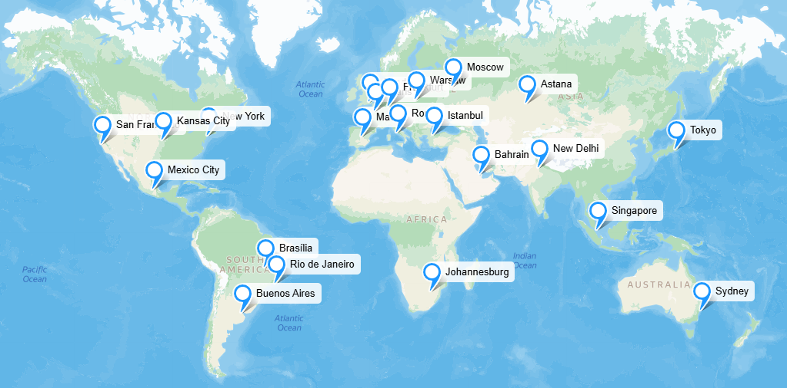
[Interactive version](https://yandex.com/maps/?um=constructor%3A584b2eb943db966c6e0f50f143c95b9da8425f8cab217a8e3bc02329a84e3d3c&source=constructorLink "Map")

## 4. Local Load Balancing

### Live Stream Balancing (data stream from a streamer)

According to [[8](https://blog.twitch.tv/en/2022/04/26/ingesting-live-video-streams-at-global-scale/ "Twitch Infrastructure Overview")], Twitch uses its custom L7 load balancer, which is close in logic to the `Least Load` balancing method.

<ins>Briefly about the load balancer:</ins>

Twitch has many proxy servers (`load balancers` in our terminology), called *Point of Presence (PoP)*, which also use custom software called *Intelligest*, which replaced *HAProxy*. "Behind" the PoPs there are `servers` (*Origin*), to which video streams will subsequently be routed. The Origins themselves then deliver the video content to viewers.

The tasks of Intelligest include periodic health checks, as well as collecting information from the Origins about their current load.

<ins>Balancing workflow:</ins>

The streamer connects to one of the PoPs (the optimal one), which terminates their connection and, using Intelligest, routes it to one of the Origins according to the following rules:
* It primarily uses information about the load on the Origins and tries to use the resources of each of them as much as possible (`Least Load`)
* Additionally, routing can be performed based on the platform's business logic:
  * Premium users can conduct a backup stream in addition to the main one, both of which must go to the same Origin and be broadcast from it
  * The load balancer can be configured so that streams from specific channels (this refers to a Twitch streamer channel on the platform) are directed to a specific Origin, regardless of which PoP the data stream comes from

The functions of the Origins include the following tasks:
* Transcoding video into various resolutions and bitrates so that a user (viewer) can choose a suitable format
* Formatting the video for further sending to the CDN

At this stage, we move on to the user (viewer) side of balancing.

### Live Stream Balancing (data stream to a viewer) [[9](https://blog.twitch.tv/en/2023/09/28/twitch-state-of-engineering-2023/ "Overview of Twitch services")]

When a viewer opens a stream page, their request is sent to the nearest datacenter, where a proxy server terminates their connection. A special algorithm (based on the so-called *Replication Tree*) finds the Origin from which the requested stream is being delivered and redirects it to the viewer.

### Summary

At this stage, we have the following. The streaming content load balancer (PoP):
* On the streamer's side
  * Terminates the connection
  * Adds and removes Origins from the list of available ones using health checks
  * Collects metrics from Origins
  * Routes the stream to a specific Origin based on the `Least Load` method or, additionally, on some business requirements
* On the viewer's side
  * Terminates the connection
  * Searches for the Origin with the requested stream
  * Directs the stream to the client

### API Request Balancing

For balancing HTTPS requests (e.g., authorization), as well as custom Twitch protocols that work over TCP and WebSocket (e.g., for various interactions with chat), we will use `Nginx` as an L7 load balancer. It will perform the following functions:
* Load balancing between the services using `Weighted Round-Robin` or `Least Connections` method for even load distribution and fault tolerance
* SSL termination
* API Gateway implementation. In particular, authorization and authentication; logging and monitoring (registration of incoming and outgoing requests, collection of statistics on performance and API usage)
* Serving static content
* Caching requests and compressing content

### Fault Tolerance

Using `Kubernetes` will help ensure higher fault tolerance and more optimal resource utilization through orchestration and scaling of services, as well as automatic recovery from failures and restarting services without downtime.

Additionally, we will use:
* Collection of metrics from services and machines and periodic health checks
* Setting up alerts to notify about critical situations

## 5. Logical DB Schema

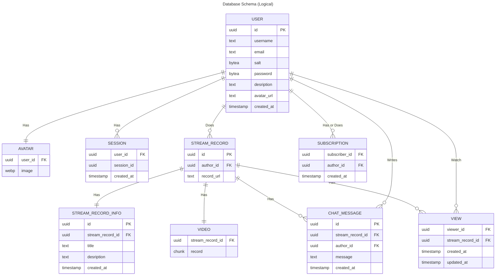

Let's calculate the approximate required storage volume to store each of the entities:

For the number of service users, we'll take 2*MAU, which, according to the [first section](#audience-1), is

$$ 140\space million\cdot 2=280\space million\space users $$

Then:

**USER**

$$ 16\space bytes\text{ (uuid - id)} + 10\space bytes\text{ (text - username)} + 40\space bytes\text{ (text - email)}+$$
$$+10\space bytes\text{ (bytea - salt)} + 32\space bytes\text{ (bytea - password)}+$$
$$+500\space bytes\text{ (text - description)} + 60\space bytes\text{ (text - avatar-url)} +$$
$$+ 8\space bytes\text{(timestamp - created-at)}=676\space bytes/user $$

The total data volume will be

$$ 676\space bytes\cdot 280\space million \approx 177\space GB $$

**AVATAR**

One image in .webp format with a resolution of 1280x800 takes up approximately ```120 KB```

Then for all users, the total storage volume will be

$$ 120\space KB\cdot 280\space million \approx 31.3\space TB $$

**STREAM_RECORD**

$$ 16\space bytes\text{ (uuid - id)} + 16\space bytes\text{ (uuid - author-id)} + 60\space bytes\text{ (text - record-url)}=92\space bytes/stream $$

From [section 2](#2-load-calculation) we have 70 million hours of streams per month. If an average stream lasts 1 hour, then the total number of streams is ```70 million```
In that case:

$$ 92\space bytes\cdot 70\space million \approx 6\space GB $$

**VIDEO**

In the [second section](#2-load-calculation), it was already calculated that the required monthly storage volume for the stream recordings themselves is ```130 PBytes```.

**STREAM_RECORD_INFO**

$$ 16\space bytes\text{ (uuid - id)} + 16\space bytes\text{ (uuid - stream-record-id)} +$$
$$+ 50\space bytes\text{ (text - title)} + 500\space bytes\text{ (text - description)} + $$
$$+ 8\space bytes\text{ (timestamp - created-at)}=590\space bytes/stream $$

Total:

$$ 590\space bytes\cdot 70\space million \approx 39\space GB $$

**CHAT_MESSAGE**

$$ 16\space bytes\text{ (uuid - id)} + 16\space bytes\text{ (uuid - stream-record-id)} + $$
$$+ 16\space bytes\text{ (uuid - author-id)} + 400\space bytes\text{ (text - message)} +$$
$$+ 8\space bytes\text{ (timestamp - created-at)}=456\space bytes/message $$

With a [total volume](#2-load-calculation) of messages of ```4 billion/month```, storage for

$$ 456\space bytes\cdot 4\space billion \approx 1.7\space TB $$

is required.

**VIEW**

$$ 16\space bytes\text{ (uuid - viewer-id)} + 16\space bytes\text{ (uuid - stream-record-id)} + $$
$$+8\space bytes\text{ (timestamp - created-at)} + 8\space bytes\text{ (timestamp - updated-at)}=48\space bytes/record $$

Let us say the average user visits 1 stream per day. Then they visit 30 streams per month. Then in a month, we will get records for

$$ 30\cdot 48\space bytes\cdot 140\space million \approx 188\space GB $$

**SUBSCRIPTION**

$$ 16\space bytes\text{ (uuid - subscriber-id)} + 16\space bytes\text{ (uuid - author-id)} + $$
$$+8\space bytes\text{ (timestamp - created-at)}=40\space bytes/record $$

According to statistics, Twitch has about 15 million streamers. However, only 1% of them have more than 50 concurrent viewers. We will take 1% of these 15 million and assume that on average each of such streamers has 1000 subscribers. We will take the resulting total number of subscribers as the number of records in the SUBSCRIPTION table:

$$ \frac{15\space million}{100}\cdot 1000\cdot 40\space \approx 5.6\space GB $$

**SESSION**

$$ 16\space bytes\text{ (uuid - user-id)} + 16\space bytes\text{ (uuid - session-id)} +$$
$$+ 8\space bytes\text{ (timestamp - created-at)}=40\space bytes/session $$

Twitch's DAU is 30 million people. Let us say each of them has two sessions: on their phone and computer. Then the total storage space occupied is:

$$ 30\space million\cdot 2\cdot 40\space \approx 2.3\space GB $$

### Summary

|Table                            |Data Size    |
|---------------------------------|-------------|
|USER                             |177 GBytes   |
|AVATAR                           |31.3 TBytes  |
|STREAM_RECORD                    |6 GBytes     |
|STREAM_RECORD_INFO               |39 GBytes    |
|VIDEO                            |130 PBytes   |
|CHAT_MESSAGE                     |1.7 TBytes   |
|VIEW                             |188 GBytes   |
|SUBSCRIPTION                     |5.6 GBytes   |
|SESSION                          |2.3 GBytes   |

### Entity Descriptions

|Entity                           |Description  |
|---------------------------------|-------------|
|USER                             |Information about a user. Both technical (*id*, *email*, *salt*, *password*) and additional (*description*, *avatar_url*, *created_at*)|
|AVATAR                           |Image in .webp format, a link to which is in the USER table|
|STREAM_RECORD                    |Information about a stream recording. Contains a link to the author (*author_id*) and the URL of the recording itself in storage (*recorde_url*)|
|STREAM_RECORD_INFO               |Additional information about a stream, filled in by the streamer and displayed to a viewer when opening the stream page. Contains a link to the stream recording (*stream_record_id*), title (*title*), description (*description*), date of broadcast (*created_at*)|
|VIDEO                            |Video in a specialized format, containing the recording of a specific stream. A link to the video is in the STREAM_RECORD table|
|CHAT_MESSAGE                     |A message in a stream's chat. Stores the message itself (*message*), stream id (*stream_record_id*), author's identifier (*author_id*), and message sending time (*created_at*)|
|VIEW                             |Records the fact that a viewer (*viewer_id*) watched a stream (*stream_record_id*) (or its recording), as well as the time of the first viewing (*created_at*) and the last one (*updated_at*)|
|SUBSCRIPTION                     |Stores a user's subscription (*subscriber_id*) to an author (*author_id*), as well as the time the subscription was made (*created_at*)|
|SESSION                          |Contains data about a user's session in the service, namely the user id (*user_id*), session identifier (*session_id*), and authorization time (*created_at*)|

### Read/Write Load

#### Write

According to [statistics](#1-topic-audience-functionality), about a third of the Twitch audience are residents of the US and Canada. At the same time, from 2023 to 2024, the number of users increased by about 10 million in these regions. Then we can estimate the total user growth across all regions at 30 million people. In that case, the RPS for writing registration records to the USER table will be

$$\frac{30\space million}{365\space days\cdot 24\space hours\cdot 60\space minutes\cdot 60\space seconds} \approx 1\space \text{RPS}$$

Thus, the load for registration writes is insignificant.

It is known that the number of messages sent in Twitch chats per month is approximately 4 billion. Then the number of requests per second is

$$\frac{4\space billion}{30\space days\cdot 24\space hours\cdot 60\space minutes\cdot 60\space seconds} \approx 1500\space \text{RPS}$$

That is, the load for writing new messages is significant.

If the average user logs into the service once a day, then with a DAU of 30 million, the load on session writes/reads will be

$$\frac{30\space million}{24\space hours\cdot 60\space minutes\cdot 60\space seconds} \approx 350\space \text{RPS}$$

The load is moderate.

From the assumption that about 70 million streams are held per month, we can say that writes to the tables with stream information occur with a frequency of

$$\frac{70\space million}{30\space days\cdot 24\space hours\cdot 60\space minutes\cdot 60\space seconds} \approx 27\space \text{RPS}$$

If the average user visits 1 stream per day, and the DAU is 30 million, then the write load on the VIEW table for stream views will be

$$\frac{30\space million}{24\space hours\cdot 60\space minutes\cdot 60\space seconds} \approx 350\space \text{RPS}$$

Estimating the number of subscriptions made per second is a difficult task due to the lack of relevant statistics, so we will assume that the write load for such information is low, since new users are added at a rate of 1 RPS, which is a very small value, so the subscriptions they make are unlikely to significantly increase this indicator. At the same time, old users do not often make new subscriptions and prefer to follow already familiar authors.

#### Write Summary

The write load is relatively low. It is expected that the read load will be the main type of load in the service. From this section, we have that only the write load for messages from all stream chats is significant. This is exactly why Twitch has a separate service for processing requests related to user interaction in chats.

#### Read

As already calculated, sessions are created/validated with a frequency of ```350 RPS```.

If a user logs in once a day, then the USER table is accessed ```350 times per second``` to check the password. Additionally, we access this table to load streamer information when connecting to a stream. This is another ```350 RPS```. We have approximately ```700 RPS``` for reading data from the USER table.

We will assume that data about subscribers and stream views (SUBSCRIPTION and VIEW entities) are requested when connecting to a stream, which means we need to process ```350 RPS``` for each of the two tables.

The main load will be on processing requests for chunks of streams being viewed. The load on the connection to the stream itself is moderate and amounts to the same ```350 RPS```. Let us calculate the load on the storage with stream recordings. It is [known](#2-load-calculation) that 2.5 million people watch streams on Twitch simultaneously. If a stream has a delay of 20 seconds, we will assume that every 20 seconds, 2.5 million users request the next 20-second chunk. Thus, the load on the entire storage or CDN from all users will be

$$\frac{2.5\space million}{20\space sec}=125\space 000\space \text{RPS}$$

#### Read Summary

As expected, the load on reading content (especially video) is very significant. For this reason, we will need to create a network of distributed storage to serve such a large number of users.

## 6. Physical DB Schema

|Entity                           |Storage              |Choice Justification|
|---------------------------------|---------------------|--------------------|
|SESSION                          |Redis                |High-performance in-memory storage, ideal for storing key-value structures and providing fast access to them. It has the functionality to set a TTL for sessions. Thus, there is no need to manually check authorization tokens for "freshness". A downside is low reliability - data can be lost if the server restarts. However, for sessions, the requirement of storage reliability and consistency is not critical|
|USER, STREAM_RECORD, STREAM_RECORD_INFO, SUBSCRIPTION, VIEW  |PostgreSQL           |PostgreSQL is a popular solution for storing data in the relational model. There are ready-made solutions and approaches to scaling. The DBMS offers full support for ACID transactions to ensure the proper level of data consistency and reliability. It is also possible to create indexes to optimize the search process|
|CHAT_MESSAGE                     |Aerospike            |A high-performance NoSQL DBMS optimized for using SSDs to speed up read and write processes. When working with chat service, according to calculations, it will be necessary to write data frequently, as well as read and send it to newly connected users. There is the functionality of caching data in memory, as well as replication|
|SUBSCRIPTION, VIEW               |ClickHouse           |An open-source analytical DBMS that is actively developed and supported. It allows for analytical Full table scan queries. Supports filling with data from an Apache Kafka stream. It will be used to provide metrics on subscribers and views to authors (streamers), as well as for internal service analytics|
|VIDEO                            |Amazon CloudFront    |Amazon CloudFront is a distributed CDN system located in more than 400 points around the world on 6 continents. What is no less important is that this service supports multi-bitrate streaming via the HLS protocol with the ability to cache media fragments to speed up content delivery and reduce the load on the service.  It also has a built-in GEO-based load balancer|
|AVATAR                           |Amazon S3            |Amazon S3 offers object data storage, which provides unlimited scalability. The service is aimed at ensuring availability, reliability, and low latency. It is also possible to create replications. The storage facilities are distributed around the world and have a convenient API for uploading and retrieving data|
|METRICS                          |VictoriaMetrics      |It is a convenient modern open-source storage for technical and product metrics. Implemented in the Go language, it is supported and has good documentation. It is considered to store data more efficiently than the similar Prometheus service; it supports both pull and push metric collection strategies;  it has its own query language, MetricsQL, with broader capabilities than PromQL; it is also provided on AWS|

### Indexing

We will use indexing to speed up searches in the storage. Note that in ```PostgreSQL``` the index on the primary key is built automatically.

* For the USER table, we will create indexes for the ```email``` and ```username``` fields for quick uniqueness checks during registration and to speed up user searches for authentication.

* In the STREAM_RECORD table, we will build the index on the ```author_id``` attribute for faster searching and retrieval of streams by a specific author. In the STREAM_RECORD_INFO table, we will create the index on ```stream_record_id```.

* For SUBSCRIPTION, we will define the index on ```subscriber_id``` and ```author_id``` to speed up the retrieval of subscription and subscriber lists, respectively.

* Similarly, we will create indexes for the ```viewer_id``` and ```stream_record_id``` fields in the VIEW table for faster searching of viewing history and, for example, counting the number of stream views.

* We will store chat messages in JSON format in Aerospike. To speed up the search for a chat related to a specific stream, we will create the index based on the ```stream_record_id``` field, and to search for messages from a specific user, we will index the ```author_id``` field.  To speed up sorting by message sending time, we can also add the index to the ```created_at``` attribute.

The SESSION structure in Redis does not need indexes, as the DBMS itself is a fast key-value store. Amazon services (S3 and CloudFront) are already optimized "under the hood" and we do not need to worry about it.

### Sharding

Almost all tables (USER, STREAM_RECORD, STREAM_RECORD_INFO, SUBSCRIPTION, VIEW, CHAT_MESSAGE) that depend on the popularity of an author can be moved to separate shards, based on the number of subscribers and views of a particular author, since these tables for them will be updated and read most often. Other users can be distributed among shards using a hash of their ```id```.

### Replication

We will use a standard physical replication scheme with one ```Master``` and multiple ```Replicas```. The ```Master``` will handle writes while multiple ```Replicas``` will read and serve data, as it was established that there are more read requests in the service than write requests. To speed up the system, ```Replicas``` can be made asynchronous, since some lag behind the ```Master``` is not critical.

### Backup Scheme

As a backup scheme, it is proposed to use ```incremental backup```, which is quite fast, although restoring data will take a little more time than with other approaches.

### Connection Multiplexing

For multiplexing connections to ```PostgreSQL```, we can use PgBouncer to reduce the number of connections to the database itself and speed up its operation.

## 7. Distributed Algorithms

### Transmuxing/Transcoding [[10](https://blog.twitch.tv/en/2017/10/10/live-video-transmuxing-transcoding-f-fmpeg-vs-twitch-transcoder-part-i-489c1c125f28/ "Live Video Transmuxing/Transcoding on Twitch")]

At peak load, Twitch processes and distributes tens of thousands of video streams simultaneously to users around the world. The following flowchart reflects the logic of content transmission from a streamer to a viewer:


The stages of establishing a connection with the author and initial processing of the video signal (*Ingest*), as well as the distribution of video streams to various CDN servers (*Replication*) and content delivery to the end consumer (*Edge*) have already been described in [previous sections of the work](#4-local-load-balancing). This part is devoted to the optimizations that were made for the most rational use of server computing power during transcoding and scaling of video content (*Transcode*).

Twitch receives a stream from an author using the ```RTMP``` streaming protocol, and the ```HLS``` protocol is used to deliver content to viewers. Thus, the incoming signal must be transformed (*Transmuxed*) into a format that the HLS protocol works with. Moreover, to ensure uninterrupted viewing of the stream for "slow" clients (with low internet speed), the source stream needs to be transcoded (*Transcode*) into a number of others with a different resolution or frame rate. A module called ```Transcoder``` exists to solve this problem. It should be noted that the original video stream (called *Source*), passing through this module, is only converted to the corresponding HLS format without changing the content itself (this is done to save computing power, since video encoding is a rather costly process in this sense, especially for video in high resolution and with a high frame rate, which the Source is likely to be). The described principle is illustrated by the following diagram:


Let us say we receive a video from a streamer via the RTMP protocol in 1080p60 format (i.e., a resolution of 1920x1080 with a frame rate of 60). We need to get 4 HLS variants of the video:
* 1080p60 HLS/H.264
* 720p60 HLS/H.264
* 720p30 HLS/H.264
* 480p30 HLS/H.264

As can be seen from the diagram above, the transcoder takes $1$  input stream and produces $N$ output streams (a *1-in-N-out* scheme). This can be achieved by running $N$ independent instances of ```FFmpeg``` (software for video processing and decoding), each of which takes $1$ stream, processes it, and outputs $1$ stream (a *1-in-1-out* scheme). Note that in our case $N = 4$. The internal structure of each FFmpeg transcoder looks like this:


Thus, in general case, we have $N$ running decoders of the original track (*Video Decoder*), $N$ scale converters (*Video Scaler*), and $N$ encoders into a format suitable for HLS (*Video Encoder*). Since the incoming and outgoing streams are the same for all $N$ decoders (*Video Decoder*), to save computational resources, we can leave only one, which will produce the decoded frames to the subsequent modules:


It is important to note that the scale converter (*Scaler*) performs the most resource-intensive work in this chain, and its operation should preferably be optimized. Twitch does this as follows:

If you look again at the required output video formats in our task, you can notice that the 720p60 and 720p30 options differ only in frame rate and, generally speaking, can use one Scaler for both. This mechanism is implemented through the use of a multi-threaded video processing model and can be illustrated by the following diagram:


As already noted, in this case, the two video tracks differ only in frame rate. The video processed by *Thread 1* has twice as many frames as the video from *Thread 2*. Thus, the frames from *Thread 2* are a subset of the frames from *Thread 1*. 

According to the algorithm, the two threads have a common buffer (*Shared Buffer*), the threads "put" frames into it, and the buffer gradually sends them to the Scaler for scaling. When a thread comes to the buffer again and puts a frame, if that frame has already been processed, it is returned to the corresponding thread and the Scaler is not called. Otherwise, the frame is placed in the buffer again and will be processed later.

As Twitch notes, this model really allows for faster and more efficient processing of video streams and is indispensable when scaling and encoding video in 4K resolution.

The described optimizations formed the fundamentals of the custom ```TwitchTranscoder```, created on the basis of the aforementioned FFmpeg. FFmpeg  is not able to use multithreading for processing if the incoming video track (Source) is only one (the number of threads used is determined precisely by their number), even if the number of outputs is $N > 1$. The algorithm developed by the company, as can be easily seen, handles this task quite successfully. To illustrate this advantage, the following benchmarks can be given:

* It is not difficult to see that when processing a single 720p60 video stream, the operating time of these two tools is almost identical, since in this case they both use one thread for transcoding, and the underlying principles are the same:


* However, if it is necessary to get two or more output streams from one input stream, the operating time of FFmpeg begins to grow linearly, while TwitchTranscoder uses the multithreaded model and performs its task much more efficiently:


## 8. Technologies

|Technology              |Application        |Justification        |
|------------------------|-------------------|-------------------|
|Go                      |Backend            |A popular modern language for writing the back-end part of applications. A fast, compiled language, by its nature well suited for working under high loads. Also well suited for a microservice architecture (gRPC, ProtoBuf, etc.), known for its asynchronous model, which will provide and simplify asynchronous request processing. An additional plus is the presence of a large number of libraries, packages, and drivers that implement a wide variety of functionality and simplify code writing                  |
|gRPC                    |Backend, microservice interaction      |An effective implementation of the Remote Procedure Call approach with the ability to use ProtoBuf as a fast and efficient protocol for communication between microservices. It integrates perfectly into Go applications      |
|Kotlin                  |Mobile, Android    |A cross-platform, popular language with a large number of technologies and specialists              |
|Swift                   |Mobile, iOS        |A popular language with a large number of tools and technologies|
|Nginx                   |Proxy/load balancing                   |A reliable, popular, supported tool for implementing various load balancing strategies, terminating SSL connections, processing HTTP(S) requests, and the ability to configure for the HLS and RTMP protocols used in our service     |
|HLS                     |Streaming, content delivery to users   |A widely used protocol for video streaming over HTTP from Apple.  It is convenient for its built-in ability to stream with ABR Streaming technology (adaptive bitrate streaming) and subtitle transmission, and it also supports a large number of codecs                   |
|RTMP                    |Streaming, receiving content from authors                   |A once-popular protocol, including for content delivery. Currently, this niche is occupied by HLS, but RTMP is still widely used precisely for receiving video content from an original source (a streamer), because, unlike HLS, it has minimal latency (<5 seconds)         |
|WebSocket               |Chat interaction   |A communication protocol over a TCP connection, most often used for real-time interaction with a server through a persistent connection. Excellent for implementing message transmission between chat users|
|PostgreSQL              |Main service DB                    |Relational model is well-suited for storing the [chosen entities](#6-physical-db-schema), there is broad support, many tools for scaling, and a transactional model|
|PgBouncer               |Multiplexing connections to PostgreSQL                  |A popular solution for this purpose. It will help reduce the load on the database by accepting connections from services and multiplexing them into a smaller number of connections to the database instances                |
|Redis                   |Session storage    |A fast in-memory database, excellent for speeding up the user authorization process. It has a fairly simple and concise query language, suitable built-in data types (key-value), and the ability to set a TTL for authorization tokens|
|Aerospike               |Stream chat        |A NoSQL database optimized for fast reading/writing with SSDs, with built-in capabilities for building indexes, caching, and replication                     |
|ClickHouse              |Analytical DBMS    |This DBMS performs excellently under load, has the ability to save and read analytical data in real-time, and also has a built-in function for filling with data from a Kafka stream|
|Amazon CloudFront       |CDN                |The service provides a distributed and scalable system for delivering content to users. It supports the HLS protocol, caching capabilities, and a built-in GEO-based load balancer                 |
|Amazon S3               |Object storage     |A reliable, replicable, and scalable solution for storing static content. A popular service with a convenient API for uploading/retrieving data |
|Kafka                   |Message broker     |A high-performance, scalable service for ensuring asynchronous interaction between components of the service's architecture. It can be easily integrated with other services and technologies due to its popularity           |
|VictoriaMetrics         |Metrics storage    |An efficient storage solution, supports pull and push metric collection strategies, has its own query language with broad functionality, integrates easily with Go, and is provided on AWS  |
|Grafana                 |Monitoring         |A popular tool, compatible with a large number of technologies, with the ability to configure notifications and alerts                   |
|Docker                  |Containerization   |Excellent for working with Kubernetes, efficiently packages services, and utilizes server resources     |
|Kubernetes              |Orchestration      |A widely known tool for orchestrating microservices, ensures fault tolerance, service scaling, and efficient machine resource utilization by managing containers depending on the load                     |

## 9. Project Flowchart

### General Flowchart

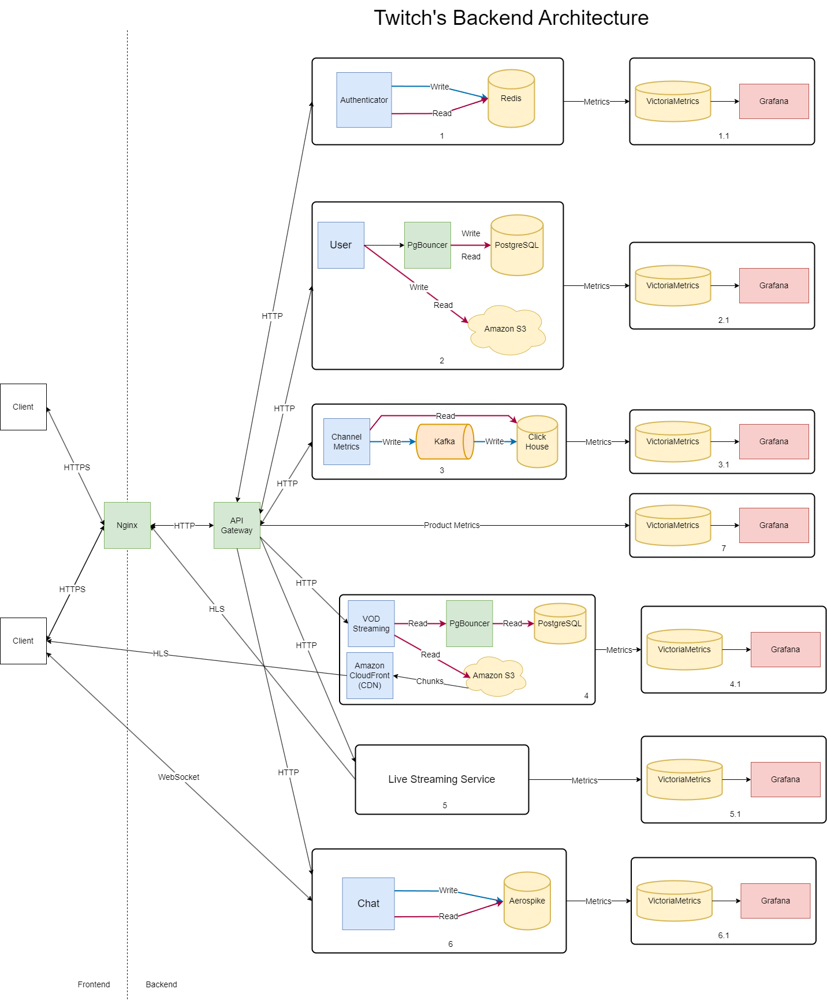

*The following notations are used in this section:*

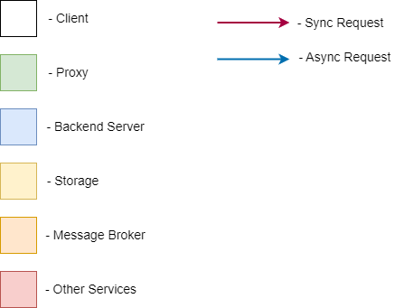

The entry point for the client in our server application is one of the ```Nginx``` instances, which balances the load on the ```API Gateway``` and terminates SSL, as can be seen from the diagram (requests within the system "travel" over HTTP). The API Gateway itself allows for additional isolation of system components and collection of API metrics, which will be discussed in more detail later.

Let us consider each of the components separately to describe the input and output data flows.

### 1. Authorization

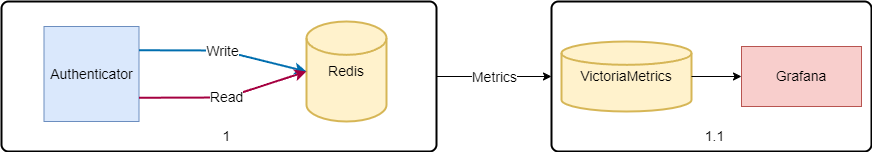

This module is responsible for working with session tokens. The ```Authenticator``` server application accepts incoming requests, creates sessions, and asynchronously saves them in ```Redis``` to speed up this process. If necessary, it accesses other modules (e.g., ```User```) through the API Gateway. All interactions with the module occur via the HTTP protocol.

### 2. User

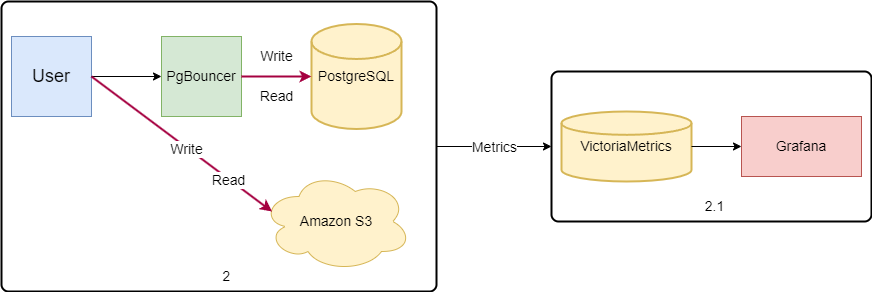

This component controls the ```PostgreSQL``` database with user information, accessing it through ```PgBouncer``` to reduce the load on the database (in terms of reducing the number of TCP connections to the DBMS). The S3 storage with user avatars is also located in this module. All writes are synchronous, as user information is important, and we cannot afford to lose it without being able to properly notify the client. Similar to the previous component, the main interaction protocol is HTTP.

### 3. Channel Metrics

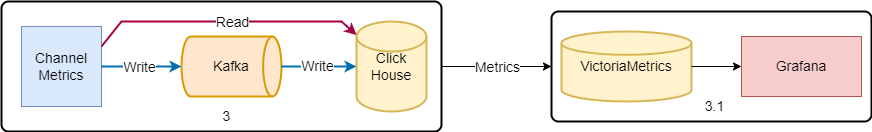

As [described earlier](#6-physical-db-schema), we use ClickHouse to collect, store, and retrieve information about the subscribers of a particular channel, as well as about the views of specific videos. This information can be used as analytics for authors or internal company analysts, so the corresponding DBMS was chosen. Data enters it asynchronously through the Kafka message broker. This allows us to not wait for another view or subscriber to be written to the database and, additionally, ClickHouse is easily configured to work with this tool.

### 4. VOD Streaming

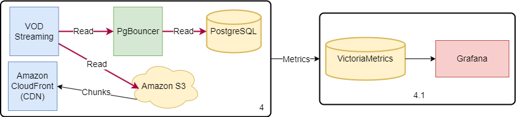

Storing and delivering stream recordings (Video On Demand) is an important feature of the entire application. Initially, we have a corresponding table in ```PostgreSQL``` with information about the stream (including a link to the video storage in S3). Through PgBouncer, this data is synchronously read from the database, and then the content from the S3 storage is sent to the CDN for delivery to viewers. This module accepts an HTTP request to receive a video stream and in response delivers HLS fragments to the client directly.

### 5. Live Streaming Service

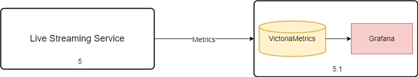

This functionality is core in our service and, therefore, is separated into a large dedicated service. We are going to focus on its implementation in a little more detail.

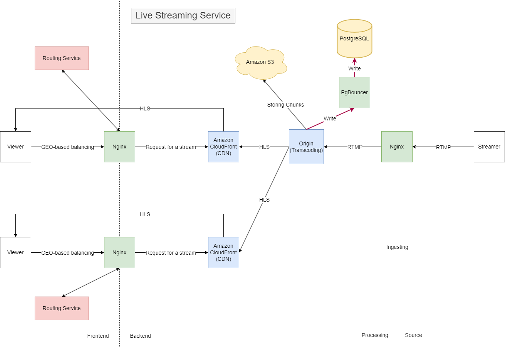

The client, on their side, connects to the nearest proxy server (Nginx is taken as an example), which, based on a number of parameters, finds the most optimal CDN and returns the video stream from it using the HLS protocol. For balancing and finding the optimal CDN, Twitch uses additional software called ```Routing Service```. 

On streamer's side, the proxy server accepts the video signal stream via the RTMP protocol, finds the necessary server (```Origin```), where the video will be transcoded into HLS format. Since this task is quite resource-intensive (transcoding was discussed in more detail in [one](#7-distributed-algorithms) of the previous sections), it was decided to allocate separate machines for it. The video "leaves" the Origin in a format ready for transmission via HLS and is sent to the CDN. Additionally, Origins have the ability to write data to S3 storage and add any useful information about streams to PostgreSQL.

### 6. Chat

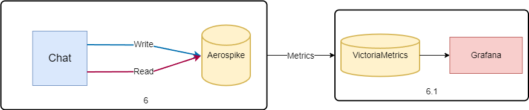

As already described, chat in Twitch is one of the most heavily loaded parts of the application. In order to optimize database access, we write messages to Aerospike asynchronously. Interaction with this module occurs via the WebSocket protocol directly with the client.

### Metrics Collection

As can be easily seen, module 7, as well as all the x.1 modules, are responsible for collecting product and technical metrics from the implemented services. VictoriaMetrics was chosen as the database for storing records with metrics.

## 10. Ensuring Reliability

It is understood that to ensure reliability in the operation of the service, it is necessary to guarantee resistance to failures at all possible levels (both at the hardware level, the application level, and the physical level) using various methods.

### System Components

|Component      |Method              |Justification       |
|---------------|--------------------|--------------------|
|Nginx          |Redundancy          |It is necessary to provide the system with a sufficiently large number of proxy servers to distribute the load among them. Moreover, it is necessary to have a certain reserve number of machines to ensure fault tolerance.  In the event that some of the main servers fail or the service receives too much load, part of the load can be directed to the reserve instances       |
|API Gateway    |Replication         |The API Gateway, just like Nginx, is in a sense an entry point to the system and a potential bottleneck. It is necessary to replicate the logic of this component's operation by, for example, dividing the API Gateway into those machines that serve web clients and those serving mobile clients. It is also necessary to install a sufficient number of instances for even load distribution between them|
|Storage        |Replication         |To reduce the read load from the database or S3, it is necessary to implement a system of replicas according to the Master-Replica scheme. This will also ensure better preservation of user data, increase data availability, and distribute the load between different replicas|
|Storage        |Backup              |Periodic backups will significantly reduce the likelihood of user data loss     |
|PostgreSQL     |Connection Multiplexing|Installing a proxy server in front of the PostgreSQL database will help maintain a number of connections to the server that is adequate for the DBMS        |
|ClickHouse     |Using Kafka         |Using a message broker will allow data to be written asynchronously, which will increase the overall speed of the system and reduce the probability of losing any data, because if one of the components fails or becomes overloaded, messages from the queue will be processed later  |
|CDN            |Redundancy          |It is necessary to create a distributed system of CDN servers to ensure a sufficient level of redundancy. In the event that one of the servers fails or becomes overloaded, the Origin begins to deliver streams to other machines, and users reconnect to them using a Retry strategy                             |

### Servers and Services

* **Resource Redundancy:** installing additional network cards, disks in servers, ensuring a sufficient amount of CPU, RAM, etc.

* **Logging and Metrics Collection:** collecting product and technical metrics from services for internal product analytics or logs for tracking errors and delays in request execution. Metrics from the machines themselves will allow monitoring the current state of the servers and, in case of a critical situation, promptly making the necessary decisions

* **Using Architectural Patterns**
  * **Well-designed Retry Strategies:** if an error occurs when accessing a service, you can try to execute the request again in the hope of getting a response eventually. An example of using a Retry strategy to reconnect a viewer to a new CDN server has already been given before. It is important to note that the number of such repeated requests should be limited in some way, so as not to overwhelm the already loaded service with similar requests. This can be implemented using the following pattern

  * **Circuit Breaker:** this pattern involves having a mechanism that controls, for example, the number of errors and the response time to requests from the service. If this metric exceeds a certain critical threshold, the Circuit Breaker temporarily prohibits the execution of requests to the service to avoid possible cascading effects and the collapse of the entire system

  * **Timeout:** if a response from a service is not returned for a certain amount of time, then we use a replicating or backup service instead

* **Internal Access Control to Services:** to avoid incidents of intentional or accidental system breakdown by service employees, it is necessary to build a clear system of access control to services, databases, etc.

* **Graceful Shutdown:** when shutting down any of the system components, it is necessary to ensure that all resources are released and processes are completed. Otherwise, this can lead to an increase in responses with a 500 status and even the loss of some user data

* **Graceful Degradation:** a fault-tolerant system must continue to provide the user with the maximum possible functionality even if some of its components fail. For example, if the ```Chat``` service fails, the video stream should not be interrupted; users will receive content, albeit in a limited form. A complete denial of service in such a case is unacceptable

### Data Centers

* **Geographically Distributed Redundancy:** it is necessary to place several data centers to ensure the fault tolerance of the application if an entire DC fails. Moreover, it is necessary to provide for the possibility of natural or other disasters, as well as power outages in a region, etc. For this, the located data centers must be sufficiently distant from each other

* **Redundant Power Lines:** in case of failure of one of the power lines, the servers and cooling systems will continue to operate from a backup line to avoid the complete loss of the entire DC

* **Redundant Cooling Systems:** a failure in the data center's cooling system will inevitably lead to its complete loss within a few minutes. To exclude such scenarios, you must always have a backup

* **Installation of Diesel Generators:** the presence of generators will allow the data center to be maintained in working condition for some time in case of a complete power failure. It is possible that this time will be enough to fix the problems and a complete denial of service can be avoided

* **Installation of Uninterruptible Power Supplies**: installing UPS in the data center racks will allow the implementation of the Graceful Shutdown principle or will give some time (about 10-15 minutes) to change the power line

* **Periodic Drills for Staff:** conducting regular drills with data center shutdowns and simulations of other emergency situations will prepare employees for such scenarios and help avoid data loss, server damage, etc.

## 11. Resource Calculation

### Storage

Based on the calculations made in [part 5 of the work](#5-logical-db-schema) regarding read and write loads and the required space in the used storage, as well as [part 2](#2-load-calculation) with the calculation of the used network traffic, we present the following table:

|Storage      |Data Volume |Load (write), RPS    |Load (read), RPS   |Traffic   |
|-------------|------------|---------------------|-------------------|----------|
|PostgreSQL   |222 GB      |28                   |1050               |482.8 KB/s|
|Redis        |2.3 GB      |350                  |350                |27.3 KB/s |
|Aerospike    |1.7 TB      |1500                 |500                |3.475 TB/s|
|ClickHouse   |193.6 GB    |400                  |700                |47 KB/s   |
|Amazon S3    |131 PB      |4900                 |72000              |1 TB/s    |

### Services

|Service        |RPS      |Traffic  |
|---------------|---------|---------|
|API Gateway    |3600     |15 MB/s  |
|Auth           |700      |700 KB/s |
|User           |700      |14 MB/s  |
|Channel Metrics|1100     |86 KB/s  |
|VOD Streaming  |200      |6 KB/s   |
|Live Streaming |350      |10 KB/s  |
|Origin         |10000    |200 GB/s |
|CDN            |125000   |1.8 TB/s |
|Chat           |2000     |3.5 TB/s |

*Note.* The RPS indicator for the `API Gateway` service was calculated as follows (based on the fact that this service is a gateway for almost all of the others):

$$ RPS_{Auth}+RPS_{User}+RPS_{ChannelMetrics}+2\cdot RPS_{VODStreaming}+$$
$$+2\cdot RPS_{LiveStreaming}=3600 $$

The doubled values of $RPS_{VODStreaming}$ and $RPS_{LiveStreaming}$ were taken to account for the part of the requests to the `Chat` service that passes through the `API Gateway` each time there is a request to `VOD Streaming` (to get a stream recording) and `Live Streaming` (to get a WebSocket connection).

The traffic for the `API Gateway` was calculated in a similar way.

### Required Resources

#### <ins>Nginx</ins>

According to tests [[11](https://blog.nginx.org/blog/testing-the-performance-of-nginx-and-nginx-plus-web-servers)], an Nginx server with 16 CPUs can handle $6\space 676$ HTTPS connections per second (CPS). The same configuration can handle $383\space  860$ RPS over HTTPS if each request contains 10 KB of data. Thus, if we assume that $RPS_{APIGateway}=RPS_{Nginx}$, then one server will be enough for us to serve external HTTPS requests.  
In [part 3](#3-global-load-balancing) 22 data centers were selected around the world. With an even distribution of load, a data center will handle $\frac{3600}{22}\approx 164$ RPS, passing through Nginx. According to tests [11], an Nginx server with 2 CPUs can handle $869$ HTTPS connections per second (CPS). The same configuration can handle $48\space 654$ RPS over HTTPS if each request accounts for 10 KB of data. This performance will be quite sufficient even taking peak loads into account. Thus, if we assume that $RPS_{APIGateway}=RPS_{Nginx}$, then one server will be enough for us to serve external HTTPS requests. Each data center will have enough with one Nginx instance. Taking redundancy into account, we will take 2. Also, 2 identical servers will be needed for the API Gateway component in each DC.

We have:

|Service    |CPU |Network    |Quantity  |
|-----------|----|-----------|----------|
|Nginx      |2   |0.5 GB/s   |44        |
|API Gateway|2   |0.5 GB/s   |44        |

#### <ins>Go Services</ins>

For the performance of Go services, let us assume:

* 1 CPU core = 500 RPS and 50 KB RAM/request (light business logic - "L")
* 1 CPU core = 100 RPS and 500 KB RAM/request (medium business logic - "M")
* 1 CPU core = 10 RPS and 1 MB RAM/request (heavy business logic - "H")

From the table above, we get the following (calculated for the load on **one data center**):

|Service (Weight)   |RPS                 |Traffic    |CPU |RAM, GB  |
|-------------------|--------------------|-----------|----|---------|
|Auth (L)           |32                  |32 KB/s    |2   |2        |
|User (L)           |32                  |700 KB/s   |2   |2        |
|Channel Metrics (L)|50                  |4 KB/s     |2   |2        |
|VOD Streaming (L)  |10                  |0.3 KB/s   |2   |2        |
|Live Streaming (L) |16                  |0.5 KB/s   |2   |2        |
|Origin (H)         |455                 |10 GB/s    |46  |64       |
|CDN (M)            |5700                |82 GB/s    |57  |64       |
|Chat (M)           |100                 |160 GB/s   |2   |32       |

In total, we have:

|Service        |Configuration                         |Quantity  |
|---------------|--------------------------------------|----------|
|Auth           |2 core CPU / 1x4 GB RAM 2400 MHz DDR4 |22        |
|User           |2 core CPU / 1x4 GB RAM 2400 MHz DDR4 |22        |
|Channel Metrics|2 core CPU / 1x4 GB RAM 2400 MHz DDR4 |22        |
|VOD Streaming  |2 core CPU / 1x4 GB RAM 2400 MHz DDR4 |22        |
|Live Streaming |2 core CPU / 1x4 GB RAM 2400 MHz DDR4 |22        |
|Origin         |24 core CPU / 4x8 GB RAM 2400 MHz DDR4|44        |
|CDN            |16 core CPU / 2x8 GB RAM 2400 MHz DDR4|88        |
|Chat           |2 core CPU / 4x8 GB RAM 2400 MHz DDR4 |22        |

#### <ins>Storage</ins>

##### PostgreSQL

According to calculations, the load on PostgreSQL servers will be $\approx 1100$ TPS. We will assume that one machine with 2 CPUs and 4 GB of RAM can handle about $5\space 000$ TPS. Taking replication into account, we will take 1 Master and 2 Replica instances.

##### Redis

According to official data, one Redis server can handle $50\space 000$ RPS. Taking replicas into account, we will take 1 Master and 2 Replica instances in a configuration of 2 CPU + 32 GB RAM + 0.5 TB of disk space.

##### Aerospike

According to the official Aerospike website [[12](https://aerospike.com/blog/new-aerospike-benchmark-demonstrates-real-time-performance-at-petabyte-scale/)], one instance with 4 CPUs and 64 GB of RAM (for possible caching) will be sufficient to handle requests from the `Chat` service. A 3 TB disk will also be required (we take it with a margin). For redundancy, we will take one additional machine.

##### ClickHouse

The read/write load described in the table above is not significant for ClickHouse. Not much disk space is required either. For this reason, we will take 2 TB disk (with a margin), 2 CPU cores, and 16 GB of RAM. An additional machine will be required for redundancy.

##### S3

We will assume that one server stores 100 TB of data and it needs 24 CPUs and 64 GB of RAM:

$$\frac{131\space PBytes}{100\space TBytes}=1\space 310\space machines$$

### Total

Let us summarize all the above calculations in the following summary table:

|Service        |CPU cores |RAM, GB  |Storage (NVMe), TB |Number of servers|
|---------------|----------|---------|-------------------|-----------------|
|Nginx          |2         |16       |0.5                |44               |
|API Gateway    |2         |16       |0.5                |44               |
|Auth           |2         |2        |0.5                |22               |
|User           |2         |2        |0.5                |22               |
|Channel Metrics|2         |2        |0.5                |22               |
|VOD Streaming  |2         |2        |0.5                |22               |
|Live Streaming |2         |2        |0.5                |22               |
|Origin         |24        |32       |0.5                |44               |
|CDN            |16        |16       |0.5                |88               |
|Chat           |2         |32       |0.5                |22               |
|PostgreSQL     |2         |4        |1                  |3                |
|Redis          |2         |32       |0.5                |3                |
|Aerospike      |4         |64       |3                  |2                |
|ClickHouse     |2         |16       |2                  |2                |
|S3             |24        |64       |100                |1310             |

## Sources

1. https://www.demandsage.com/twitch-users/
2. https://visualsbyimpulse.com/countries-most-twitch-viewers-top-15/
3. https://worldpopulationreview.com/country-rankings/twitch-users-by-country
4. https://www.businessofapps.com/data/twitch-statistics/
5. https://help.twitch.tv/s/article/video-on-demand?language=ru
6. https://www.adweek.com/media/easier-to-share-twitch-recap-for-2022-begins-rolling-out/#:~:text=Twitch%20began%20rolling%20out%20its,the%20Amazon%2Downed%20streaming%20platform
7. https://marketsplash.com/ru/statistika-twitch/
8. https://blog.twitch.tv/en/2022/04/26/ingesting-live-video-streams-at-global-scale/
9. https://blog.twitch.tv/en/2023/09/28/twitch-state-of-engineering-2023/
10. https://blog.twitch.tv/en/2017/10/10/live-video-transmuxing-transcoding-f-fmpeg-vs-twitch-transcoder-part-i-489c1c125f28/
11. https://blog.nginx.org/blog/testing-the-performance-of-nginx-and-nginx-plus-web-servers
12. https://aerospike.com/blog/new-aerospike-benchmark-demonstrates-real-time-performance-at-petabyte-scale/